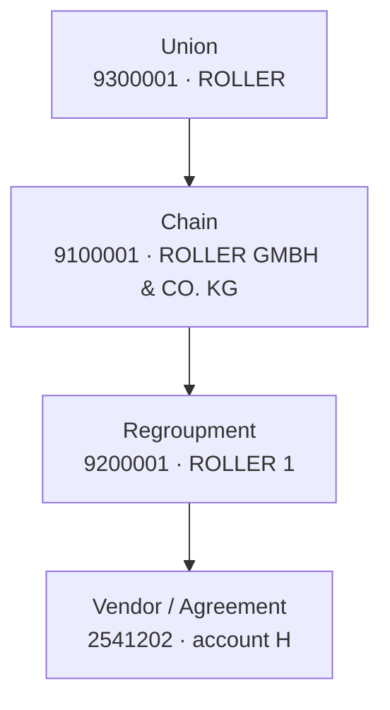
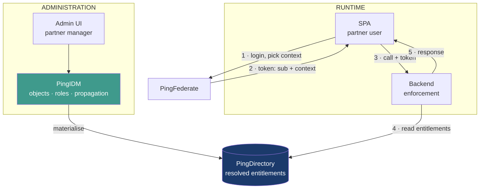

Ce qu'il décrit, c'est de la délégation de confiance déguisée en authentification. Sa phrase clé : le SP envoie un token « to validate the authentication of the user ». Or le SP n'a pas authentifié l'utilisateur, il l'a identifié (vidéo-ident). Identification et authentification ne sont pas la même chose, et c'est précisément cette confusion qui fait tomber son argument sur l'article 24 du RTS. L'IDP ne valide rien, il constate une affirmation.

Il faut d'abord lever une ambiguïté, parce que le reste de la discussion en dépend. Demande-lui explicitement laquelle des deux options il décrit :

- **Option A** : le token est émis par le SP (JWT signé par lui, ou opaque) et l'IDP l'accepte comme preuve. Dans ce cas le SP devient émetteur d'identité et l'IDP n'est plus l'autorité. Inacceptable, et non conforme art. 24.
- **Option B** : le SP s'authentifie auprès de l'IDP (client credentials, mTLS) et l'IDP émet en retour une référence à usage unique. Là c'est l'IDP qui reste autorité, et c'est structurellement ton Magic Link, avec un canal différent. Défendable.

Son raisonnement « ce n'est pas une question de rôle » est juste sur un point, et c'est à reconnaître : ton `onboarding.authorized` porté comme attribut dans l'annuaire est effectivement un état persistant qui traîne. Sa logique de flux ponctuel est meilleure sur ce plan précis. Mais la conclusion qu'il en tire ne suit pas : remplacer un rôle par un token ne résout rien si le token porte la même capacité sans preuve de possession derrière.

Le point qu'il n'adresse toujours pas, et sur lequel je resterais : quel que soit le mécanisme, entre la réception de l'info par API et la création du mot de passe, personne n'a prouvé que la personne devant le navigateur est bien celle qui a fait la vidéo. Le canal API sécurise la relation SP vers IDP. Il ne sécurise pas la relation IDP vers utilisateur. C'est exactement le trou que le Magic Link ou un OTP sur le numéro vérifié vient combler.

La formulation que je poserais en réunion : « Nous sommes d'accord sur le canal API. La question qui reste ouverte est celle du binding utilisateur. Comment l'IDP établit-il, de son côté, que le porteur de la session est le sujet du proofing ? »


Il vient de te donner raison, mais en déplaçant le débat. Trois choses à relever.

**Il y a maintenant une contradiction formelle dans son propre document.** La colonne de droite du Flow 4 dit « Compliant with PSD2 / RTS », celle du Flow 5 dit « fully compliant » et « no inherent violations » avec un mapping eIDAS 8 à 12. Son mail dit que rien ne s'aligne pleinement avec eIDAS. Les deux ne peuvent pas tenir ensemble. C'est à faire corriger dans le document, sinon quelqu'un en comité s'appuiera sur les tableaux et pas sur le mail.

**Il confond deux problèmes distincts, et c'est le point important.** La qualité du proofing d'identité relève d'eIDAS et du KYC, c'est une décision métier et LCB-FT, pas une décision d'architecture IAM. Le binding entre ce proofing et le credential émis relève de l'article 24 du RTS, et celui-là est un problème d'ingénierie parfaitement soluble. En déclarant le tout « pas pleinement garantissable », il fait passer un défaut d'architecture corrigeable pour une limite inhérente. Le risque qu'il veut faire porter n'est pas celui qu'il croit.

**Un risque accepté doit avoir un porteur.** Dans une banque, ça implique une fiche formelle, un propriétaire nommé, une échéance de remédiation. Il faut lui demander qui signe. Souvent ça suffit à faire revenir les gens vers la solution technique.

Voici ce que je répondrais :

**On the contradiction**

"Before we register a risk, we need the document to say the same thing as this email. Flow 4 is currently marked as compliant with PSD2 and RTS, and Flow 5 as fully compliant with eIDAS Articles 8 to 12 with no inherent violations. If our shared position is that identity assurance is not fully guaranteed in any flow, those compliance statements need to be revised. Otherwise the tables will be what gets cited downstream."

**On separating the two problems**

"I would separate two questions that are currently merged. The first is the quality of the identity proofing itself, which is an eIDAS and KYC matter and a business decision, not an IAM design decision. The second is the binding between that proofing and the credential the IDP issues. The second is not an inherent limitation. It is an architecture choice, and it is solvable. In the current design the IDP authenticates the user on the strength of a token asserted by the SP, with no proof that the browser arriving at the enrolment page belongs to the subject of the proofing. That gap can be closed regardless of the assurance level of the video identification."

**On the risk**

"If we do register a risk, it should be scoped to proofing assurance only, and it needs a named owner, a severity, and a remediation date. I would not want the binding gap folded into it, because accepting a risk we can engineer away is harder to defend than accepting one we cannot."

**On compensating controls, since he asked**

"Concretely, and in order of value: bind the session to a possession factor the IDP verifies itself, with an OTP sent to the number captured during proofing, before any credential is created. Replace the SP-issued token with a back-channel call authenticated by mTLS, where the IDP returns a one-time opaque reference with a short TTL. Have the SP transmit a signed proofing artefact carrying method, assurance level, transaction reference and timestamp, and have the IDP retain it. Enrol the possession factor before the password. Apply the Article 4(3) limits on attempts and session lifetime. Add step-up SCA for sensitive operations during the first period after onboarding, and monitor for device or IP discontinuity between the proofing session and the enrolment session."

Le dernier point est celui qui l'intéressera, parce qu'il lui permet de sortir par le haut sans avoir à dire que son Flow 4 était faux.


Le POC PUMA est bien celui-là — le Portail PUMA, celui où un MANAGER crée des utilisateurs COMMERCIAL dans PingDirectory.

**Ce qu'il a déjà :**
- Angular (4200/4300) + Spring Boot (8081)
- Client OAuth2 `puma-portal` sur PingFederate, PKCE, sans PAR ni RAR
- Création d'utilisateurs par **SCIM v2 REST**, affectation aux groupes par LDAP
- Groupes MANAGER / COMMERCIAL, utilisateurs `thomas.martin` et `sophie.bernard`
- Le guard qui n'autorise que les MANAGER

C'est exactement ton mock d'administration, déjà écrit. Il crée des comptes et affecte des rôles par API — il ne lui manque que la dimension nœud.

**Ce qu'il n'a pas : PingAuthorize.** Il est dans la stack Docker de `banking-spa` (7443, PAP 9443), pas dans PUMA.

**Donc le montage :** pars de PUMA, ajoute le conteneur PingAuthorize et le PAP depuis le compose de `banking-spa`. Les deux partagent déjà PingFederate et PingDirectory.

Ensuite :
1. LDIF de la hiérarchie ROLLER + les attributs `partnerGrant`, `opScope`, `reportScope`
2. Étendre le formulaire PUMA : au lieu de choisir COMMERCIAL/MANAGER, choisir un rôle **et** un nœud
3. Trust Framework dans le PAP : Services LDAP + policies
4. Un endpoint de test dans le Spring Boot qui appelle le PDP et renvoie PERMIT/DENY

Deux pièges connus de tes notes : le client PingFederate disparaît au restart Docker (pas de volume), et la licence PingDirectory expirait vers le 1er juillet 2026 — à vérifier avant de démarrer.


`g` = un **grant**, c'est-à-dire une affectation donnée à l'utilisateur. Un grant est un couple :

```
g = (node, role)
```

`g.node` est donc **le nœud sur lequel ce rôle a été accordé** — le périmètre de l'affectation.

```
User 3 :
  g1 = (9200005, Salesman)   → g1.node = 9200005
  g2 = (9200006, Viewer)     → g2.node = 9200006
```

La règle teste `g.node ∈ Parents(t)`. Autrement dit : le nœud où j'ai reçu ce rôle est-il un ancêtre de la cible, ou la cible elle-même ?

```
Action : contract.update sur 2700014
Parents(2700014) = { 2700014, 9200005, 9100002, 9300001 }

g1.node = 9200005  → présent    → le rôle Salesman s'applique ici
g2.node = 9200006  → absent     → le rôle Viewer ne s'applique pas
```

C'est ce couple `g.node` / `Parents(t)` qui fait toute la mécanique : `g.node` vient de l'utilisateur, `Parents(t)` vient de la cible, et la décision est leur intersection.

Et c'est exactement le `g.node` dont tu demandes s'il survit à la propagation vers PingDirectory. Si seules les permissions sont écrites sans lui, la règle ne peut plus être évaluée.


Technically yes — PUMA already does most of it: create a user, assign a role, write to PingDirectory via SCIM and LDAP. Adding the node dimension is one more field in the form and one more attribute on the write.

And there is an argument few people see: **if the PDP is centralised, delegation comes for free.** PUMA calls the same PDP before writing — "can this manager assign this role on this node?". Same rule, same engine. With IDM, delegation is a separate mechanism you configure on its own.

What you take on in production:

- **synchronisation with the PRM** — the hierarchy comes from an upstream system: import it, detect drift, handle deletions. That is the real work, and it is what IDM does best
- **lifecycle** — leavers, moves, deactivation, orphaned accounts
- **referential integrity** — a grant on a deleted node, a role that no longer exists
- **audit trail of administrative changes**
- **code ownership** — who maintains it in three years, who applies the fixes

None of these is infeasible. Together they are a product to carry over time, not a portal.

My view: it is a legitimate build-vs-buy call, but it is not the fight to pick now. Consors is already building Mobility on IDM, and the August 13 decision is settled. You gain more by leaving administration to IDM and using PUMA as the mock in your POC — it isolates the one question still open, which is where the decision lives.


Hi Philip,
Thanks — role specialization and how roles are provisioned is exactly what I need on Monday.
Can we look at one simple case together? Take User 3, with two grants on the same tree:
Code
After provisioning runs, I would like to see the PingDirectory entry for User 3 — the real one, on screen.
What I want to understand is simple: does the node travel with the permissions, or do only the permissions land in the entry?
It matters because of what comes next. If the node is not there, how can the application know that contract.update holds on ROLLER 5 but not on ROLLER 6? And if we later remove one permission on ROLLER 6 only, how does the entry show where the removal applied?
Same question for a CustomList, since its members sit under different regroupments.
Happy to walk through it live if that is easier.


graph TD
    N0["N0 · Union<br/>9300001 ROLLER"]
    N1["N1 · Chain<br/>9100001 ROLLER GMBH &amp; CO. KG"]
    N2["N2 · Chain<br/>9100002 ROLLER GMBH"]

    N3["N3 · RG 9200001<br/>ROLLER 1"]
    N4["N4 · RG 9200002<br/>ROLLER 2"]
    N5["N5 · RG 9200003<br/>ROLLER 3"]
    N6["N6 · RG 9200004<br/>ROLLER 4"]
    N7["N7 · RG 9200005<br/>ROLLER 5"]
    N8["N8 · RG 9200006<br/>ROLLER 6"]
    N9["N9 · RG 9200007<br/>ROLLER 7"]

    A1["2541202 H<br/>2283003 I"]
    A2["2480004 J<br/>2602700 K<br/>2700001 L"]
    A3["2700002 M · 2700003 N<br/>2700004 O · 2700005 P"]
    A4["2700006 Q · 2700007 R<br/>2700008 S ⚠"]
    A5["2700009 T · 2700010 U<br/>2700011 V · 2700012 AA<br/>2700013 AB · 2700014 AC"]
    A6["2700015 AD<br/>2700016 AE"]
    A7["2700017 AF"]

    CL["CL_A · CustomList<br/>2700010 · 2700015 · 2700017"]

    N0 --> N1 & N2
    N1 --> N3 & N4 & N5 & N6
    N2 --> N7 & N8 & N9
    N3 --> A1
    N4 --> A2
    N5 --> A3
    N6 --> A4
    N7 --> A5
    N8 --> A6
    N9 --> A7

    CL -.->|2700010| A5
    CL -.->|2700015| A6
    CL -.->|2700017| A7

    style N0 fill:#1B3A6B,color:#fff
    style N7 fill:#3F9A8C,color:#fff
    style N8 fill:#3F9A8C,color:#fff
    style CL fill:#7A3E9D,color:#fff


User 3  ==> Salesman  sur  2480004
User 3  ===>  Viewer    sur  2700010
The pairing is explicit here: Salesman on 2480004, Viewer on 2700010.
After propagation — two possible outcomes
Case 1 — the node did not travel

dn: uid=user3,...
cfEntitlement: contract.read
cfEntitlement: contract.update
cfEntitlement: stock.read
cfEntitlement: report.read


The "on 2480004" information is gone. The application reads contract.update and cannot tell that it only holds on 2480004. It will allow contract.update on 2700010, where User 3 is only a Viewer.

Case 2 — the node travelled
dn: uid=user3,...
cfGrant: 2480004:contract.read
cfGrant: 2480004:contract.update
cfGrant: 2480004:stock.read
cfGrant: 2700010:report.read


The pairing survives. contract.update on 2700010 matches no entry → DENY. Correct.


What IDM covers natively
  1. Convert union/chain/regroupment/vendor to a relationship graph
  2. Role + assignment: a role attached to a node (managed
     organization) is inherited by its members and by child nodes
  3. Propagation on update — materialisation at write time,
     entitlements written to PingDirectory
  4. Delegated administration and privileges for partner managers
  5. REST endpoints for a custom business UI

Not covered — to be confirmed with Ping
  6. Role scoped to a node — the propagated entitlement is a flat
     set of actions; the originating node does not travel with it.
     Salesman on 2480004 + Viewer on 2700010 yields the union.
  7. Negative exclusion per node, without multiplying role variants
  8. Runtime decision (REQ-5) — which component answers
     "can this user do this action on this target"
     


- The Excel file shared before the workshop contains sample PoC data
  for one partner: 1 Union, 2 Chains, 7 Regroupments, 21 Agreements
- Not representative of production volumes — to be confirmed


# Partner Authorization — Context, Problem, Solution

*Ping AuthZ workshop, Aug 13 2026 · Vendor_Hierarchy_UCR.xlsx · Ping IDM Basics deck*

---

## 1. Context

### 1.1 Scope

- Partner business apps must enforce rights against a partner organisation hierarchy
- Users are partner employees (salespeople, shop managers, regional managers) — not our customers
- Each user acts only on the part of the organisation they are assigned to

### 1.2 Hierarchy



- Current dataset: 1 Union, 2 Chains, 7 Regroupments, 21 Agreements
- Each spreadsheet row is a leaf carrying its full ancestor path
- Ping's own slide adds: not all partners have all levels configured
- Ping's own slide adds: a user's scope can span separate hierarchies (vendor 3000030 sits in the POCO tree)

### 1.3 Requirements

| # | Requirement | Type |
|---|---|---|
| R1 | Assign business apps to hierarchy levels | Administration |
| R2 | Create roles, group permissions into them | Administration |
| R3 | Assign roles at hierarchy levels, edit permissions | Administration |
| R4 | Assign roles to partner users | Administration |
| R5 | App retrieves role definition at runtime by selected context | **Runtime** |

### 1.4 Workshop outcome (Aug 13)

- PingAuthorize ruled out — assessed as a centralised policy engine, not an administration tool
- PingIDM advised instead; demo showed vendor structure down to user, with profiles, roles, entitlements
- PoC to be run, split into CF and Central streams; follow-up in 2 weeks
- Open risks flagged: remote IdP support, IDM pricing, Phase 1 due end of 2026

---

## 2. Problem

### 2.1 Three functions are being treated as two

- **Administer** — create, assign, delegate → IDM, no debate
- **Resolve** — compute effective rights, propagate inheritance → IDM, confirmed by their slides
- **Decide** — permit or deny at the moment of the click → **not covered by anyone**

R1 to R4 were assessed. R5 was not. IDM produces the data; it does not consume it at runtime.

### 2.2 Consequences if enforcement stays undefined

- No central audit trail of authorization decisions
- One enforcement implementation per business application, with guaranteed drift
- Delay between a right being revoked and the revocation taking effect
- No contextual decision possible (amount, time of day, risk level)

### 2.3 Two axes, not one

- **Role** = what the user can do — inherited downward from the assignment node
- **Scope** = where the user may do it — assigned upward from the leaves
- Both must hold. Reference case:

| Action | Target 2700014 | Why |
|---|---|---|
| `contract.update` | **DENY** | role reaches target, but target not in operational scope |
| `report.read` | **PERMIT** | reporting scope is the regroupment 9200005 |

Same user, same target, opposite answers. Any model that cannot produce both is wrong.

### 2.4 Model gaps revealed by Ping's slide 2

| Gap | Evidence | Impact |
|---|---|---|
| Multiple hierarchies | User 3 reaches vendor 3000030 in POCO tree | Flat row alone is insufficient |
| Variable depth | "not all partners have all levels configured" | Fixed 4-level model not guaranteed |
| Role per (vendor, app) | "vendor 2480004 as BusinessApp:Salesman", "2700010 as BusinessApp:Viewer" | Scope is a triple, not a vendor list |
| Negative exclusions per node | "vendors below Roller2 and vendor 2541202 don't grant download stock list within that role" | Materialised roles multiply combinatorially |
| Custom List | (2700015, 2700017, 2700010) across three regroupments | Not a hierarchy level — needs explicit reverse index |
| Cross-shop user visibility | employee of 2541202 must later work for 2283003, different shop manager | Delegated admin scope is its own model |

### 2.5 Blocking question

- **Does one Agreement Number correspond to exactly one vendor?**
- If 1:1 → each row flat and complete, membership test against four values
- If 1:N → path belongs to the agreement, runtime context must be the Agreement Number, vendor→agreements index required, reporting per vendor double-counts
- This determines the primary key of every managed object in IDM
- Not detectable in testing — surfaces months after go-live, in reconciliation

### 2.6 Data point to confirm

- Regroupment 9200004 (ROLLER 4) appears under both chains (2700006/2700007 under 9100001, 2700008 under 9100002)
- If confirmed, the hierarchy is a graph, not a tree

---

## 3. Solution

### 3.1 Component split

| Component | Job | On decision path |
|---|---|---|
| PingFederate | Authenticates, carries selected context in token | Yes |
| PingIDM | Managed objects, roles, assignments, propagation, delegated admin | No |
| PingDirectory | Stores resolved entitlements | Yes |
| Business app / backend | Enforcement point | Yes |
| PingAuthorize | Central decision point | **To be decided** |



### 3.2 What IDM covers natively

- `managed/organization` typed union / chain / regroupment / vendor — the hierarchy as a relationship graph
- `managed/role` typed profile / role, linked to `managed/entitlement`
- Virtual property mode **Relationship** — traverses the relationship graph on update, i.e. materialisation at write time
- Assignment propagation down the organisation graph
- Delegated administration and privileges for partner managers
- REST-first endpoints for a custom business UI
- Object update hooks for custom logic

### 3.3 What we still build

- Business UI on the REST API — the IDM console targets IAM admins, not shop managers
- Custom List membership and its reverse index (agreement → lists)
- Scope-per-dimension rule (operational vs reporting)
- Enforcement logic in each business application, unless a central PDP is chosen

### 3.4 Token

```json
{
  "sub": "user1",
  "aud": "contract-app",
  "scope": "contracts reports",
  "partner_context": "9300001",
  "partner_level": "union"
}
```

- Two flat claims — no RAR required
- Context is a user choice, signed by the AS, and re-validated at enforcement
- Scope lists stay out of the token: they would freeze until expiry, so a revoked right would survive until next login
- Token size independent of perimeter size (1 agreement or 300)

### 3.5 Decision rule

```
parents(t) = { t, regroupment(t), chain(t), union(t) } + customLists(t)

hasRole = a grant g exists where
             g.node ∈ parents(target)
             AND action ∈ permissions(g.role)

inScope = action is operational
             ? opScope     ∩ parents(target) ≠ ∅
             : reportScope ∩ parents(target) ≠ ∅

PERMIT if hasRole AND inScope   ·   DENY otherwise
```

- Combining algorithm: deny unless permit
- No rule may widen a scope

### 3.6 Volume handling

- Test membership, never transport the list
- Store scope by node, not by leaf — `opScope: 9200005` covers six agreements in one value
- Index `groupedRetailerNo`, `chainRetailerNo`, `unionRetailerNo` for the reverse query (context selector)
- Partial perimeters (5 of 6 agreements) still require enumeration → needs an `opScopeExclude` attribute

### 3.7 Operational rules

- Cache on ancestors only, 5–15 s. Never cache scopes.
- Degraded mode: no answer from the directory → deny. No permissive fallback.
- Propagation delay must be measured and formally accepted, not discovered.

---

## 4. Sequencing

| Step | Action | Exit criteria |
|---|---|---|
| 0 | Answer the Agreement Number question | Primary key fixed |
| 1 | Model the hierarchy as IDM managed objects | Slide-2 cases represented (multi-hierarchy, variable depth, custom list, exclusions) |
| 2 | Configure propagation, measure it | Propagation delay figure, under realistic volume |
| 3 | Run requirement scenarios end to end, no UI | R5 demonstrated, including the DENY/PERMIT pair on 2700014 |
| 4 | Decide the enforcement point | Central PDP vs per-application, decided explicitly |
| 5 | Business UI and delegated admin | — |

Step 1 data must be organised by lifecycle, not by "static vs dynamic":

| Data | Written by | Frequency |
|---|---|---|
| Hierarchy | source system | rare, batch |
| Custom Lists | business | medium |
| Roles → permissions | business | medium |
| User assignments | partner manager | frequent |

---

## 5. Open questions for the follow-up

1. Does one Agreement Number correspond to exactly one vendor?
2. Where is the decision enforced at runtime — centrally, or per application?
3. How does IDM materialise a role carrying negative exclusions per node, without combinatorial explosion?
4. How are multiple hierarchies and variable depth handled in a single user's scope?
5. How are Custom Lists created and maintained?
6. What propagation delay is acceptable between a revoked right and its effect?
7. Does IDM support the remote IdP use case (raised by David N., still open)?
 
