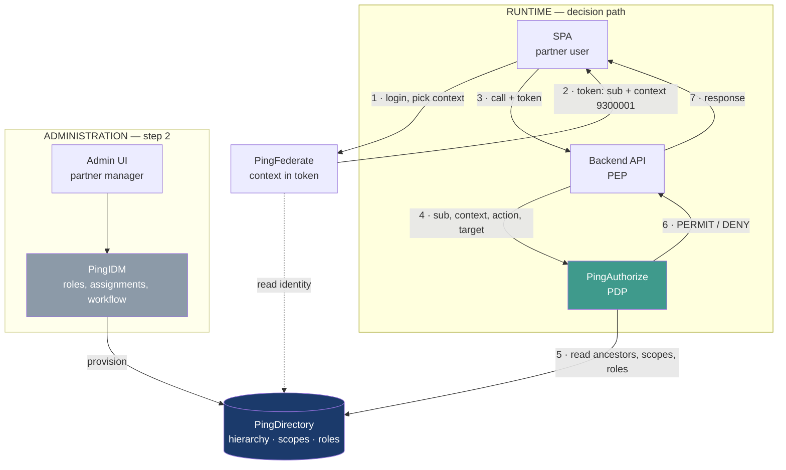

Hi Miyuki,

Thank you for the detailed minutes. Two remarks from my side, for the follow-up.

1. I agree with the conclusion on the product choice. For this specific need, PingIDM covers both the administration and the resolution of rights: the organisation hierarchy is modelled as managed objects, and entitlements are propagated down the graph. This means the business application performs a lookup of already-resolved entitlements rather than a runtime decision, which makes a central policy engine unnecessary here. I would only note that this holds as long as the propagation is reliable and its delay is explicitly accepted — when a partner manager revokes a right, it takes effect once propagation has run, not immediately. We should agree on an acceptable delay during the PoC rather than discover it later.

2. A few points appear in Tim's slides but not in the minutes, and they affect the data model we are asked to deliver. Could we cover them at the follow-up?
   - Roles carrying negative exclusions per node ("vendors below Roller2 and vendor 2541202 don't grant download stock list within that role") — how does IDM materialise this without multiplying role variants?
   - A user's scope spanning separate hierarchies (vendor 3000030 in the POCO tree)
   - Variable depth — "not all partners have all levels configured"
   - Rights granted per vendor and per application ("2480004 as BusinessApp:Salesman", "2700010 as BusinessApp:Viewer")
   - Custom Lists, whose members sit under different regroupments — how are they created and maintained?
   - Cross-shop user visibility, where an employee created by one shop manager later works for a shop managed by another

One last question that blocks the model: does one Agreement Number correspond to exactly one vendor, or can a vendor hold several agreements? This determines the primary key of every managed object, and it is the kind of thing that surfaces long after go-live rather than during testing.

Happy to bring the data model draft to the follow-up.

Best regards,
Max


# Partner Authorization — Approach and Sequencing

*Reference note ahead of the PING AuthZ workshop*
*Source material: Vendor_Hierarchy_UCR.xlsx, rows 2–22*

---

## 1. Context

### 1.1 What we are building

Partner-facing business applications need to enforce authorization based on a
partner organisation hierarchy. The users are not our customers — they are
employees on the partner side: salespeople, store managers, regional managers
working for a retail group.

Each of them must be able to act only on the part of the partner organisation
they have been assigned to, with the permissions their role grants them.

### 1.2 The hierarchy

The hierarchy is four levels deep and fixed:

```
Union          9300001  ROLLER
  └── Chain    9100001  ROLLER GMBH & CO. KG
        └── Regroupment  9200001  ROLLER 1
              └── Agreement  2541202  (account H)
```

The dataset currently holds 1 Union, 2 Chains, 7 Regroupments and 21 Agreements.

Critically, **the spreadsheet is already denormalised**: every row is a leaf that
carries its complete ancestor path in dedicated columns. There is no tree to walk
at runtime — the lineage of any agreement is readable in a single record.

### 1.3 Functional requirements

From the workshop brief:

| # | Requirement |
|---|---|
| R1 | A business user assigns business applications to levels of the partner hierarchy |
| R2 | A business user creates application roles and groups permissions into them |
| R3 | A business user or partner manager assigns roles at hierarchy levels, and edits permissions in those roles |
| R4 | A business user or partner manager assigns roles to partner users |
| R5 | The business application retrieves the role definition at runtime, based on the user's selected context |

### 1.4 The reference scenario

The brief provides one worked example, which we use throughout this note:

- The profile **Salesman** groups roles **R1** (Manage Contract) and **R2** (Reporting)
- Salesman is assigned at the **Union** level — node `9300001`
- **User1** inherits R1 from that assignment
- User1's operational scope is limited to agreements `2700010` and `2700011`
- User1's reporting scope is the **Regroupment** `9200005` (ROLLER 5), which
  contains six agreements

---

## 2. Problem

### 2.1 There are two independent axes, not one

The scenario looks like role-based access control, but it is not. User1 holds a
role granted at the top of the hierarchy, and separately holds an assignment to a
small set of leaves near the bottom. These are two different things:

- **The role** determines *what* the user knows how to do
- **The scope** determines *where* the user is allowed to do it

An effective permission requires both. Any model that collapses them into a single
notion of "access" will fail on the very first user whose reporting perimeter is
wider than their operational one — which is already the case in the reference
scenario.

### 2.2 The scope differs per action type

User1 operates on two agreements but reports on an entire regroupment. So the
scope is not one list — it is one list *per dimension of action*.

This produces the test case that matters most:

| Action | Target | Expected |
|---|---|---|
| `contract.update` | 2700014 | **DENY** |
| `report.read` | 2700014 | **PERMIT** |

Same user, same target, opposite answers. If a proposed model cannot produce both,
it does not cover the requirement.

### 2.3 One relation does not fit the tree

The Hierarchy Level list in the source file contains an entry that is not a level:

```
Custom List (2700015, 2700017, 2700010)
```

Its three members sit under three different Regroupments — `9200006`, `9200007`
and `9200005`. No ancestor test can produce that set. Membership must be stored
explicitly and indexed in reverse (agreement → lists), and kept in step whenever
a list is edited.

This is the only relation in the model that genuinely requires materialisation.

### 2.4 One open question blocks the primary key

Each row carries both an `Agreement Number` and an `Account Name`. Two separate
columns suggest two entities upstream. The question is unresolved:

> **Does one Agreement Number correspond to exactly one vendor, or can a single
> vendor hold several agreements?**

The consequences diverge sharply:

**If one-to-one.** Each row is flat and complete. Deciding a right is a membership
test against four values already present on the record. No traversal, no
additional index beyond the Custom List.

**If a vendor holds several agreements.** The ancestor path becomes a property of
the agreement, not of the vendor — the same point of sale can sit under two
different Regroupments depending on the contract. The runtime context must then
be the Agreement Number rather than the vendor, a vendor → agreements index is
required, and reporting aggregated per vendor will silently double-count.

This is not a detail. It determines the primary key of the entire authorization
model, and it is not the kind of error that surfaces during testing — it surfaces
months after go-live, in reconciliation.

### 2.5 A data point to verify

Regroupment `9200004` (ROLLER 4) appears to span both chains: agreements `2700006`
and `2700007` under chain `9100001`, and `2700008` under chain `9100002`. If
confirmed, the hierarchy is a directed graph rather than a tree, and "the chain of
ROLLER 4" has no single answer. Worth confirming against the source system.

---

## 3. Solution

### 3.1 Component responsibilities

| Component | Role | On the decision path? |
|---|---|---|
| **PingFederate** | Authenticates the user, carries the selected context in the token | Yes |
| **PingDirectory** | Holds the hierarchy, the scopes, the role catalogue | Yes |
| **PingAuthorize** | Evaluates the decision | Yes |
| **PingIDM** | Administers roles, assignments and relationships | **No** |
| **Backend API** | Policy enforcement point | Yes |
| **SPA** | Context selection, presentation | — |



PingIDM writes into PingDirectory and does nothing else. Steps 1 to 7 work without
it — which is exactly why the proof of concept can be built before IDM is
introduced.

### 3.2 What goes in the token

Only what is a user *choice*, never what is a *right*:

```json
{
  "sub": "user1",
  "aud": "contract-app",
  "iss": "https://sso.example.com",
  "iat": 1756036800,
  "exp": 1756038600,
  "scope": "contracts reports",
  "partner_context": "9300001",
  "partner_level": "union"
}
```

Two flat claims. A regional manager covering three hundred agreements carries
exactly the same token as a salesperson covering one — perimeter size never
enters it.

**Why not put the scope in the token.** It would freeze until expiry. When a
partner manager removes a vendor from someone's scope, the removal would not take
effect until the next login. That is not acceptable in a banking context.

**Why the context can stay.** It is a selection made by the user, signed by the
authorization server, and it gives us an auditable record of the context the user
believed they were working in. The PDP re-validates it on every decision, so it
grants nothing by itself.

### 3.3 What the PDP resolves

Enforcement point sends:

```json
{
  "sub": "user1",
  "context": "9300001",
  "action": "contract.update",
  "resource": "2700014"
}
```

PingAuthorize then reads three things.

**The target's lineage** — one record, fixed size:

```
dn: agreementNumber=2700014,ou=agreements,dc=partners
  accountName:       AC
  groupedRetailerNo: 9200005
  chainRetailerNo:   9100002
  unionRetailerNo:   9300001
```

**The subject's grants and scopes:**

```
dn: uid=user1,ou=partnerUsers,dc=partners
  partnerGrant: 9300001|Salesman
  opScope:      2700010
  opScope:      2700011
  reportScope:  9200005
```

**The role catalogue:**

```
Salesman → R1, R2
R1       → contract.read, contract.update
R2       → report.read
```

### 3.4 The rule

```
ancestors(t) = { t, t.groupedRetailerNo, t.chainRetailerNo, t.unionRetailerNo }
               ∪ t.customLists

hasRole = ∃ g ∈ subject.partnerGrant :
             g.node ∈ ancestors(target)
             AND action ∈ permissions(g.role)

inScope = action.dimension = operational
             ? subject.opScope     ∩ ancestors(target) ≠ ∅
             : subject.reportScope ∩ ancestors(target) ≠ ∅

PERMIT if hasRole AND inScope
DENY   otherwise
```

Combining algorithm: **deny-unless-permit**. No rule may widen a perimeter.

### 3.5 Worked decisions

**`contract.update` on 2700014 → DENY**
Ancestors are `{2700014, 9200005, 9100002, 9300001}`. The grant node `9300001`
is in that set, so the role reaches the target, and R1 contains the action. But
opScope is `{2700010, 2700011}` and does not intersect. The user has the
capability without the assignment.

**`report.read` on 2700014 → PERMIT**
reportScope `{9200005}` intersects the ancestors, and R2 contains the action.

**`contract.update` on 2700010 → PERMIT**
Role inherited from the union, and the target is in opScope.

**`report.read` on 2700015 → DENY**
Ancestors are `{2700015, 9200006, 9100002, 9300001}`. reportScope `{9200005}`
does not intersect.

### 3.6 Handling volume

Three mechanisms, in order:

**Test membership, never enumerate.** The question is never "which three hundred
agreements does this user cover" but "is this one of them". One test, no list
transported.

**Store scope by node, not by leaf.** `opScope: 9200005` covers the six agreements
of ROLLER 5 in a single value. Three hundred agreements spread over twelve
regroupments is twelve values, not three hundred.

**Index the ancestor attributes.** With equality indexes on `groupedRetailerNo`,
`chainRetailerNo` and `unionRetailerNo`, the reverse query — listing the
agreements under a node, needed to populate the context selector — stays
proportional to the result set.

The case that resists is a partial perimeter: five agreements out of six in a
regroupment. That requires enumeration. If the business needs exclusions, add an
`opScopeExclude` attribute and extend the rule to `included AND NOT excluded`.

### 3.7 Operational safeguards

- **Cache**, short (5–15 s), on ancestors only. They change rarely. Never cache
  scopes — that reintroduces the propagation delay we removed.
- **Degraded mode**: if PingDirectory does not answer, the PDP denies. No
  permissive fallback, ever.
- **Latency budget**: two to three directory reads per decision. This must be
  measured during the POC, not estimated.

### 3.8 What PingIDM covers

PingIDM is the right component for the administration layer, and it covers most
of R1 to R4 natively:

- Managed objects and relationships model the hierarchy as a graph
- Managed roles map directly onto "a role is a set of permissions"
- Assignment propagation is a materialisation mechanism
- A full REST API for the business UI, and BPMN workflow for approvals

What remains to be built:

- **The business UI.** The IDM admin console targets IAM administrators, not a
  partner manager at a retail group. A light front end over the REST API.
- **The Custom List index.** IDM stores the relationship; the reverse index and
  its refresh are ours to define.
- **The scope-per-dimension rule**, which is business logic.

One dependency to note: IDM's managed roles propagate an assignment to targets,
not to all transitive descendants without scripting. With a fixed four-level
hierarchy this is not needed. If a fifth level appears, or if the ROLLER 4 anomaly
is confirmed, that assumption breaks.

---

## 4. Proposed sequencing

**Step 0 — Answer the Agreement Number question.**
It determines the primary key. Nothing below is worth starting without it.

**Step 1 — Model in PingDirectory.**
Not "static versus dynamic" but by lifecycle, since each has its own write path,
refresh strategy and cache policy:

| Data | Written by | Frequency |
|---|---|---|
| Hierarchy (U / C / RG / A) | upstream system | rare, batch |
| Custom Lists | business | medium |
| Roles → permissions | business | medium |
| User assignments | partner manager | frequent |

**Step 2 — Wire PingAuthorize and measure.**
Not a binary choice between token and runtime attributes: the token carries the
context, the PDP resolves the target. What the POC must produce is a latency
number under realistic directory load.

**Step 3 — Run the requirement scenarios end to end, with no UI.**
Including at least one write-path scenario: what happens when an agreement moves
to another Regroupment, or a Custom List is edited, and how long before the PDP
decides on the new data. A POC that only validates steady state validates a system
that does not exist in production.

**Step 4 — Then PingIDM**, knowing exactly what it has to manage.

---

## 5. Questions for the workshop

1. Does one Agreement Number correspond to exactly one vendor?
2. When a partner manager assigns a role, what is it attached to — a contract, a
   point of sale, or an organisational node?
3. How is scope-per-dimension (operational versus reporting) modelled in the
   Trust Framework?
4. How are Custom Lists expected to be created and maintained?
5. Is the four-level depth stable, or should the model accommodate a fifth?
6. What is the p99 latency of a decision with three resolved attribute providers,
   and what is the behaviour in degraded mode?
