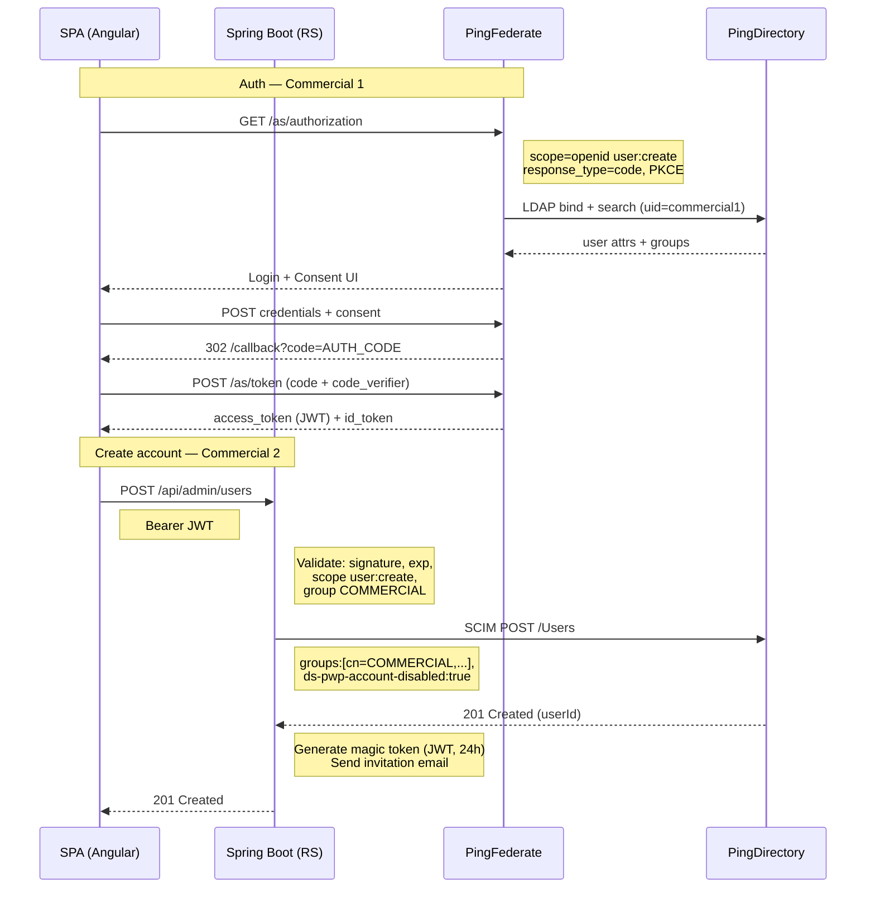
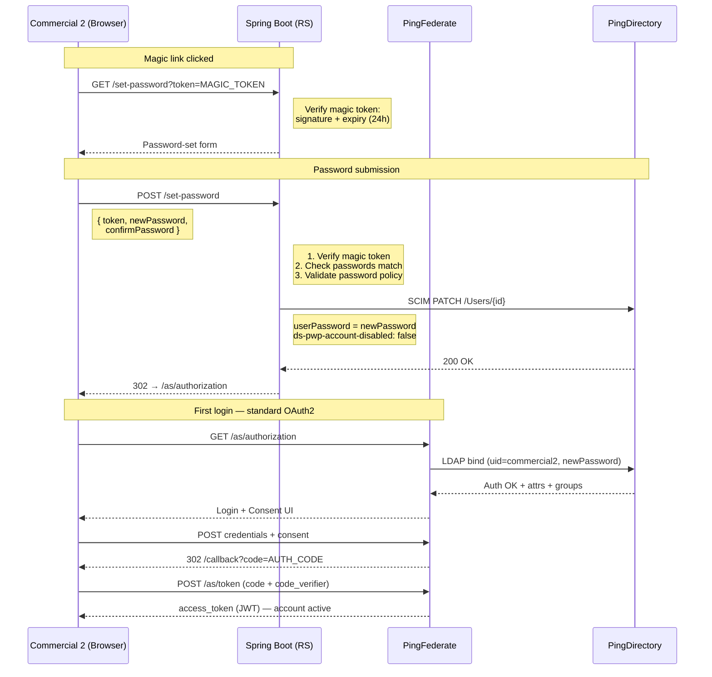

# Proxying PingFederate APIs via Spring Boot

**Banking IAM Team — May 2026 — v1.0**

---

## Table of Contents

1. [Context](#1-context)
2. [Problem — Why Not Call PingFederate or PingDirectory Directly?](#2-problem)
3. [Solution — Spring Boot as a Proxy](#3-solution)
4. [Sequence Diagrams](#4-sequence-diagrams)
5. [Security Summary](#5-security-summary)

---

## 1. Context

This document describes the architecture for creating commercial user accounts from an Angular Single-Page Application (SPA) inside a banking platform.

The platform uses the following components:

- **Angular SPA** — the front-end used by commercial agents
- **Spring Boot** — the backend Resource Server (RS)
- **PingFederate** — the Authorization Server (AS), running on-premise on port 9031
- **PingDirectory** — the LDAP user store

**Business goal:** a commercial agent (Commercial 1) can create a new account for a colleague (Commercial 2) directly from the SPA. The new account is created in PingDirectory, assigned a role, and the new user receives an invitation email with a magic link to set their password.

---

## 2. Problem

### Why Not Call PingFederate or PingDirectory Directly?

A naive approach would be to let the SPA call the PingFederate Admin API or the PingDirectory SCIM/LDAP API directly. This causes several serious problems.

### 2.1 CORS Issues

Browsers enforce the Same-Origin Policy. PingFederate Admin APIs are **not designed to be called from a browser**. They do not return the correct `Access-Control-Allow-Origin` headers. The browser will block every request.

> **Security Risk:** Even if you could configure CORS on PingFederate, exposing the Admin API to the public internet is a critical security risk.

### 2.2 Credential Exposure

The PingFederate Admin API and PingDirectory SCIM API require privileged credentials (admin username + password, or a service account). If the SPA calls these APIs directly, those credentials must be stored in the browser — which is completely insecure. Any user who opens the browser developer tools can steal them.

### 2.3 No Authorization Control

If the SPA calls the directory APIs directly, there is no way to enforce business rules. For example:

- A commercial agent should only be able to create accounts with the `commercial` profile.
- Only authenticated users with the correct role should be allowed to create accounts.
- The system should log who created which account.

None of this is possible when the SPA talks directly to the directory. The Spring Boot layer is where these rules are enforced.

### 2.4 Direct LDAP from the Browser is Impossible

LDAP is a binary TCP protocol. **Browsers cannot speak LDAP.** It is technically impossible for a browser to connect to a directory server directly. All LDAP operations must go through a server-side component.

### 2.5 No Audit Trail

If the SPA calls APIs directly, there is no centralized, trusted log. The Spring Boot RS acts as a single entry point where every action is logged with the identity of the caller.

| Problem | Impact |
|---|---|
| CORS blocked by browser | SPA cannot reach PingFederate Admin API at all |
| Admin credentials in the browser | Any user can steal them via dev tools |
| No business rule enforcement | Anyone can create any account type |
| LDAP is not HTTP | Technically impossible from a browser |
| No audit trail | Cannot track who did what |

---

## 3. Solution

### Spring Boot as a Proxy

The SPA never talks to PingFederate Admin API or PingDirectory directly. It only talks to the **Spring Boot Resource Server**, which holds the privileged credentials and enforces all business rules.

The flow works like this:

1. Commercial 1 authenticates via OAuth2 Authorization Code + PKCE against PingFederate.
2. PingFederate verifies the credentials against PingDirectory (LDAP bind).
3. PingFederate returns a JWT access token containing the user's scopes and LDAP groups.
4. Commercial 1 fills in the form to create Commercial 2 and submits it to Spring Boot.
5. Spring Boot validates the JWT (signature, expiry, scope, group membership).
6. Spring Boot calls PingDirectory SCIM API to create the user and assign the role.
7. Spring Boot generates a magic token and sends an invitation email.
8. Commercial 2 clicks the link, sets their password via Spring Boot, which calls PingDirectory to update it.
9. Commercial 2 is redirected to the login page and authenticates normally.

### 3.1 What Spring Boot Checks Before Creating an Account

| Check | How it works |
|---|---|
| JWT signature | Validated with PingFederate's public key (JWKS endpoint) |
| Token expiry | The `exp` claim must not be in the past |
| Required scope | The token must contain `scope: user:create` |
| Role check | The `groups` claim must contain `cn=COMMERCIAL,ou=groups,dc=example,dc=com` |
| Profile restriction | Commercial agents can only create accounts with `profile = commercial` |
| Input validation | Email format, age range, required fields — all checked before calling PingDirectory |

### 3.2 User Creation Payload

The SPA sends this JSON body to `POST /api/admin/users`:

```json
{
  "firstName":  "Jean",
  "lastName":   "Dupont",
  "email":      "jean.dupont@bank.com",
  "address":    "12 Rue de la Paix, Paris",
  "age":        34,
  "profile":    "commercial"
}
```

Spring Boot maps `profile` → LDAP group DN, and adds `ds-pwp-account-disabled: true` so the account cannot be used until the password is set.

### 3.3 Password Initialization via Magic Link

PingDirectory requires a password before a user can authenticate. The account is created in a **disabled state**. Spring Boot generates a short-lived signed JWT (the magic token) containing the `userId` and sends it by email.

When Commercial 2 clicks the link:

- The browser opens the password-set page served by Spring Boot.
- Commercial 2 enters their new password and confirms it.
- Spring Boot verifies the magic token (signature + expiry, typically 24h).
- Spring Boot calls PingDirectory SCIM `PATCH` to set the new password and enable the account — using its own **privileged bind account**, not the user's old password.
- Spring Boot redirects the browser to the PingFederate login page.

> **Key point:** Spring Boot does **not** need the old password. It uses a privileged service account (e.g. `cn=Directory Manager`) to perform the password reset. This is the standard admin-initiated reset pattern.

---

## 4. Sequence Diagrams

### 4.1 Authentication + User Account Creation




---

### 4.2 Magic Link + Password Set + First Login




---

## 5. Security Summary

| Security principle | How it is applied |
|---|---|
| No admin credentials in the browser | Spring Boot holds the PingDirectory service account — the SPA never sees it |
| Short-lived tokens | OAuth2 access tokens expire quickly (PingFederate config); magic tokens expire after 24h |
| Least privilege | Spring Boot's service account can only modify user entries — not read all data |
| Role-based access control | The LDAP group in the JWT determines what the caller is allowed to create |
| Password never transmitted as plain text | Magic token contains only `userId` — password is set over HTTPS in a separate step |
| Audit trail | Every Spring Boot endpoint logs the caller's JWT `sub` (user ID) and the action performed |

---

*Internal — Banking IAM Team — May 2026*
