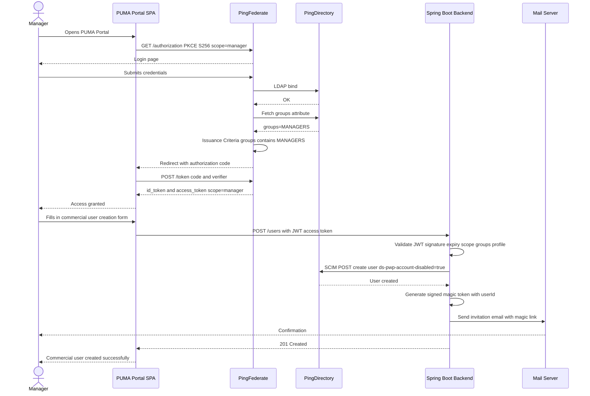
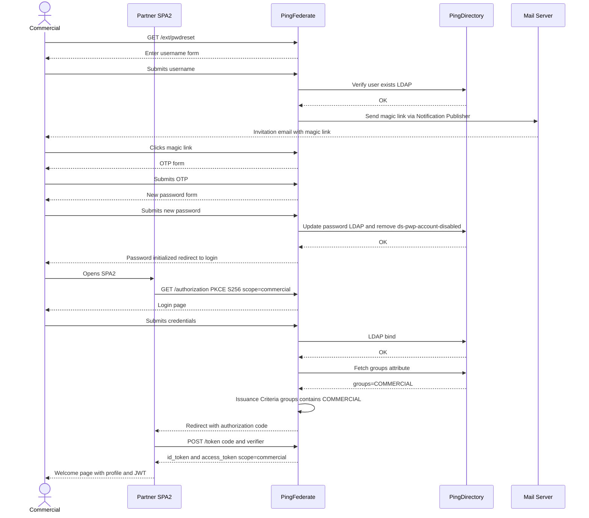

# PUMA Portal - Identity and Password Management Architecture

## 1. Problem Statement

In the current implementation, the PUMA portal acts as a proxy for user management but also handles sensitive password data during the first-time creation of a commercial user. This means the portal receives, processes, and transmits a password that it should never touch.

A password is a secret. It must never transit through an application layer that is not specifically designed to handle it securely. The portal is a provisioning tool, not an identity provider. Having the portal manipulate passwords during account creation introduces an unnecessary risk and violates the principle of least privilege.

The goal is to ensure that passwords are managed exclusively by PingFederate and PingDirectory, and that the portal never sees, generates, or transmits any credential.

---

## 2. Solution Overview

The solution separates two distinct concerns:

The portal handles user provisioning only. It creates the account in PingDirectory in a disabled state and delegates everything related to credentials to the PingFederate and PingDirectory layer.

PingFederate handles all authentication flows, including the password initialization flow via a magic link sent by email. It is also responsible for enforcing preliminary access controls based on the authenticated user role before any provisioning action is allowed.

PingDirectory stores users and credentials. It exposes a SCIM API used by the Spring Boot backend for provisioning. Accounts are created with the attribute ds-pwp-account-disabled set to true, which means the account cannot be used for authentication until a password has been defined for the first time.

---

## 3. Role of Each Actor

### SPA (Angular Frontend)

The SPA is the user interface for the Manager. It initiates the OAuth2 Authorization Code flow with PKCE against PingFederate. It never calls PingDirectory or the PingFederate Admin API directly. All provisioning requests go through the Spring Boot backend. Once authenticated, the SPA sends the user creation form to the backend along with the access token.

### Spring Boot Backend (Resource Server)

The Spring Boot backend is the only component that talks to PingDirectory via SCIM. When it receives a user creation request, it performs the following preliminary checks on the JWT access token before doing anything:

- JWT signature validated against PingFederate JWKS endpoint
- Token expiry checked
- Required scope user:create must be present
- The groups claim must contain cn=COMMERCIAL,ou=groups,dc=example,dc=com for a Manager creating a commercial account
- Profile restriction: a commercial agent can only create accounts with profile set to commercial

If all checks pass, Spring Boot calls PingDirectory SCIM API to create the user with ds-pwp-account-disabled set to true. It then generates a short-lived signed magic token containing the userId and sends an invitation email to the new user.

### PingFederate (Authorization Server)

PingFederate is responsible for all authentication and preliminary authorization controls. It enforces Issuance Criteria based on the LDAP group membership of the authenticated user before issuing a token:

- If the authenticated user belongs to the group MANAGERS, PingFederate issues a token with scope manager
- If the authenticated user belongs to the group COMMERCIAL, PingFederate issues a token with scope commercial
- If the group check fails, authorization is denied and no token is issued

PingFederate also handles the full password initialization flow via the /ext/pwdreset endpoint. It generates the magic link, sends the email via the Notification Publisher, handles OTP validation, collects the new password, and updates PingDirectory directly via LDAP. At no point does the portal or Spring Boot touch the password.

### PingDirectory (LDAP / SCIM)

PingDirectory stores all user accounts. Accounts created by Spring Boot via SCIM are created with ds-pwp-account-disabled: true. This means the account exists in the directory but cannot be used for authentication. This state is lifted automatically by PingFederate when the user completes the password initialization flow for the first time.

---

## 4. Account Lifecycle

A commercial account goes through the following states:

State 1 - Created and disabled. The Manager creates the account via PUMA. Spring Boot calls PingDirectory SCIM with ds-pwp-account-disabled: true. The account exists but cannot authenticate.

State 2 - Invitation sent. Spring Boot generates a magic token and sends the invitation email. The commercial user receives a link to set their password.

State 3 - Password initialized. The commercial user follows the magic link, completes OTP verification, and sets their password via PingFederate. PingFederate updates PingDirectory and removes the ds-pwp-account-disabled flag. The account is now active.

State 4 - Authenticated. The commercial user can now authenticate on SPA2 using the standard OIDC flow with PKCE.

---

## 5. Sequence Diagram 1 - Manager Authentication and Commercial User Creation

---

## 6. Sequence Diagram 2 - Commercial User Password Initialization and Authentication on SPA2

