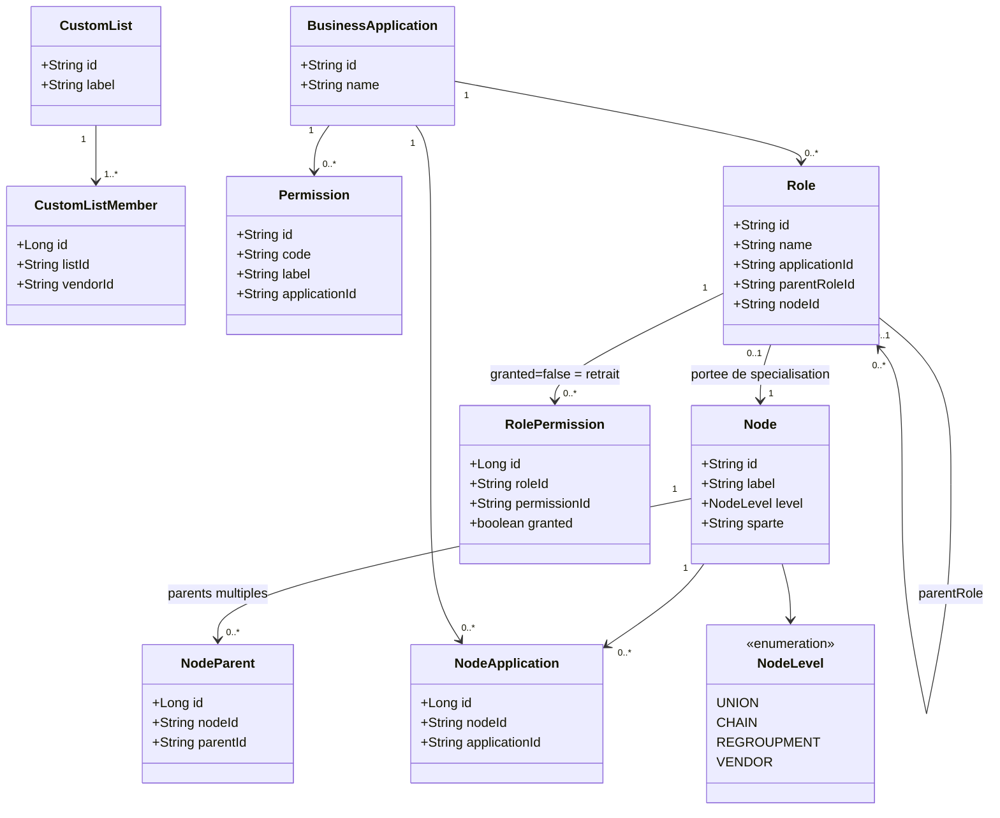
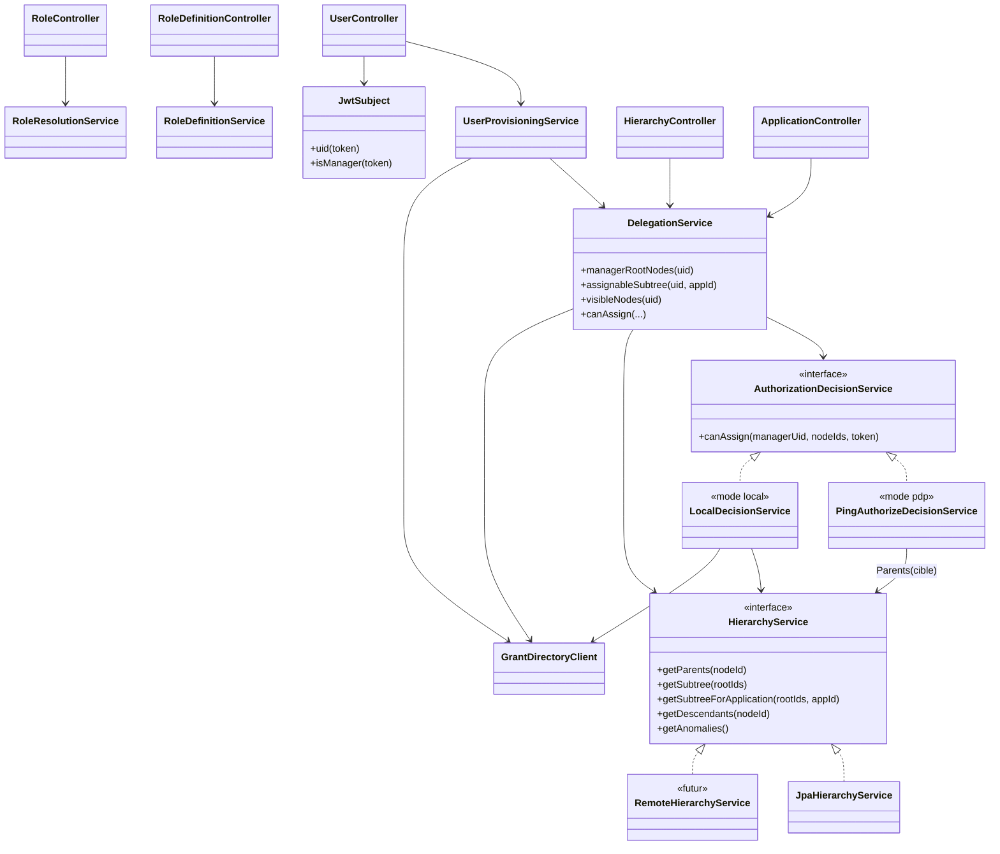
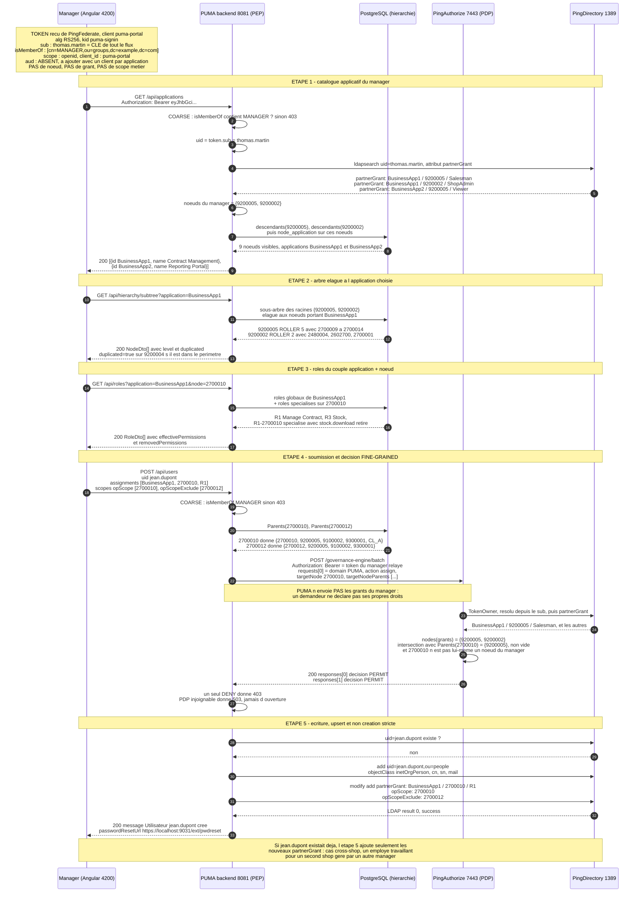

# PUMA — modele, code et installation

Un seul document : les diagrammes Mermaid, puis le code source complet de chaque couche.
Mermaid ne porte que des diagrammes, le code est donc en blocs de code dans le meme
fichier. Extension `.md` : en `.mmd`, le visualiseur tente de parser les 90 Ko comme une
seule source Mermaid et rend "Maximum text size in diagram exceeded".

Base : POC `com.poc.banking` (Spring Boot 8081) et `banking-app` (Angular 4200).
Sources metier : `Vendor_Hierarchy_UCR.xlsx`, `Retail Media Markt-Structure`,
`Mobility Eder-User-Permissions-Structure-V2`, `Partner Hierarchy - Mobility - Auto Eder.pdf`,
deck "IDM Basics - BNP/Consors" (Tim Vogt), requirements d'Ujjwal Kumar du 30/07,
messages de Philip Haussmann du 07/09.

---

## 0. PostgreSQL local, sans conteneur

L'instance est celle deja installee sur le Mac.

```bash
pg_isready -h localhost -p 5432

# Homebrew : le superuser par defaut est ton compte macOS, pas "postgres".
psql -d postgres -c "CREATE ROLE postgres LOGIN SUPERUSER PASSWORD 'postgres';"
```

Sans `psql`, faire la meme chose dans le Query Tool de pgAdmin :

```sql
SELECT rolname FROM pg_roles WHERE rolname = 'postgres';
CREATE ROLE postgres LOGIN SUPERUSER PASSWORD 'postgres';
```

Hibernate cree les tables (`ddl-auto: update`), `data.sql` charge la hierarchie.
`defer-datasource-initialization: true` est obligatoire, sinon `data.sql` s'execute avant
la creation des tables.

`pom.xml` : retirer H2, ajouter `org.postgresql:postgresql` en scope runtime.
Frontend : `npm install @angular/material @angular/cdk`.

Verification apres demarrage :

```sql
SELECT level, count(*) FROM node GROUP BY level ORDER BY level;
SELECT node_id, count(*) FROM node_parent GROUP BY node_id HAVING count(*) > 1;
```

La seconde doit rendre exactement une ligne, `9200004` : ROLLER 4 sous deux chains.
Meme information par l'API, `GET /api/hierarchy/anomalies`.

---

## 1. Contraintes tirees des donnees reelles

- un noeud peut avoir **plusieurs parents** : 9200004 est sous 9100001 et 9100002
- les niveaux peuvent etre **sautes** : chez Auto Eder `ChaineNr = 0` et `RegroupNr = 0`,
  les vendors pendent directement a l'union
- **plusieurs unions** : une foret, pas un arbre
- la **Custom List** n'est pas un niveau : ensemble arbitraire de vendors, seul moyen de
  regrouper les 6 vendorids d'Auto Eder qui n'ont pas d'ancetre commun
- la specialisation de role est **soustractive** : "when we specialize roles, we only
  remove entitlements"
- les roles sont **specialises par organisation**, sans heritage descendant : la liste des
  roles depend du noeud, pas seulement de l'application
- trois perimetres : `opScope`, `opScopeExclude`, `reportScope`

---

## 2. Les deux niveaux de controle

C'est la distinction qui structure tout le reste.

| | Coarse-grained | Fine-grained |
|---|---|---|
| Question | as-tu le droit d'ouvrir PUMA, et quelle application | as-tu le droit d'affecter **sur ce noeud** |
| Modele | RBAC | ReBAC sur la hierarchie |
| Porte par | le token : `isMemberOf`, plus tard `aud`, `scope` | rien dans le token |
| Evalue par | Spring Security, en lecture de claim | PingAuthorize (`puma.authz.mode: pdp`) |
| Cout | nul | un appel PDP par soumission |

Aucun scope OAuth ni aucune audience ne sait exprimer "sur ce noeud precis" : c'est
pourquoi le nœud ne va jamais dans le token et pourquoi la decision se prend a la lecture.

Ce qui doit etre ajoute au token : `sub`, absent du token actuel et indispensable, puisque
c'est la cle de lecture des grants du manager. Plus tard `aud`, quand il y aura un client
OAuth par application. Ce qu'il ne doit jamais porter : ni noeuds, ni grants, ni scopes
metier.

Aucun plugin PingFederate n'intervient ici. Le `ParValidationAdapter` est un IdP Adapter
qui valide les parametres PAR avant l'ecran de login : autre sujet, autre moment.

---

## 3. Ordre du formulaire : application, puis noeud, puis role

- **application d'abord** parce que c'est ainsi que le manager raisonne, et parce qu'elle
  permet d'elaguer l'arbre aux seuls noeuds qui l'exposent
- **noeud ensuite**, dans le sous-arbre du manager croise avec les noeuds portant
  l'application
- **role en dernier**, parce qu'il depend du couple application + noeud

L'ordre application -> role -> noeud est impossible : sans le noeud, la liste des roles
n'existe pas.

---

## 4. Modele de donnees



Aucun grant, aucun scope, aucun utilisateur ici : ils vivent dans PingDirectory. La base
locale ne porte que la hierarchie, fait externe bouchonne, plus le referentiel
applications / roles / permissions.

---

## 5. Couches applicatives



---

## 6. Sequence de creation, avec les deux niveaux de controle



Lecture du diagramme : les fleches pleines sont les appels, les fleches pointillees les
reponses avec leur contenu reel. Le format `application / noeud / role` est celui de
l'attribut `partnerGrant`, ou le separateur reel est un pipe, ecrit tel qu'IDM le produirait.

Le point 4 est le seul endroit ou une decision d'autorisation metier est prise. Elle est
externalisee : PUMA ne calcule rien, il fournit le contexte de la ressource et applique le
verdict. En `puma.authz.mode: local`, la meme formule est evaluee en process, pour tourner
sans PingAuthorize et mesurer l'ecart de latence.

---

## 7. Ecrit dans PingDirectory

Attributs multivalues a declarer au schema sur `ou=people` :

```
uid: nouveau.vendeur
partnerGrant: BusinessApp1|9200005|Salesman
partnerGrant: BusinessApp2|2700010|Viewer
opScope: 2700010
opScopeExclude: 2700012
reportScope: 9200005
```

Jamais `roles: [...]` et `nodes: [...]` separes : produit cartesien, donc elevation de
privilege.

---

# 8. Code source

Fichiers qui **remplacent** un existant : `dto/CreateUserRequest.java`,
`controller/UserController.java`, `resources/application.yml`,
`features/create-user/create-user.component.ts`.

## Entites JPA

### `backend/src/main/java/com/poc/banking/entity/BusinessApplication.java`

```java
package com.poc.banking.entity;

import jakarta.persistence.*;

/** Nommee BusinessApplication et non Application pour eviter la confusion avec Spring. */
@Entity
@Table(name = "application")
public class BusinessApplication {

    @Id
    private String id;

    @Column(nullable = false)
    private String name;

    protected BusinessApplication() { }

    public BusinessApplication(String id, String name) {
        this.id = id;
        this.name = name;
    }

    public String getId() { return id; }
    public String getName() { return name; }
}
```

### `backend/src/main/java/com/poc/banking/entity/CustomList.java`

```java
package com.poc.banking.entity;

import jakarta.persistence.*;

@Entity
@Table(name = "custom_list")
public class CustomList {

    @Id
    private String id;

    private String label;

    protected CustomList() { }

    public CustomList(String id, String label) {
        this.id = id;
        this.label = label;
    }

    public String getId() { return id; }
    public String getLabel() { return label; }
}
```

### `backend/src/main/java/com/poc/banking/entity/CustomListMember.java`

```java
package com.poc.banking.entity;

import jakarta.persistence.*;

/**
 * Index inverse vendor -> listes. Une Custom List n'est pas un niveau de l'arbre :
 * elle traverse la hierarchie, donc l'appartenance doit etre materialisee.
 */
@Entity
@Table(name = "custom_list_member",
       uniqueConstraints = @UniqueConstraint(columnNames = {"list_id", "vendor_id"}))
public class CustomListMember {

    @Id
    @GeneratedValue(strategy = GenerationType.IDENTITY)
    private Long id;

    @Column(name = "list_id", nullable = false)
    private String listId;

    @Column(name = "vendor_id", nullable = false)
    private String vendorId;

    protected CustomListMember() { }

    public CustomListMember(String listId, String vendorId) {
        this.listId = listId;
        this.vendorId = vendorId;
    }

    public Long getId() { return id; }
    public String getListId() { return listId; }
    public String getVendorId() { return vendorId; }
}
```

### `backend/src/main/java/com/poc/banking/entity/Node.java`

```java
package com.poc.banking.entity;

import jakarta.persistence.*;

@Entity
@Table(name = "node")
public class Node {

    @Id
    private String id;

    @Column(nullable = false)
    private String label;

    @Enumerated(EnumType.STRING)
    @Column(nullable = false)
    private NodeLevel level;

    private String sparte;

    protected Node() { }

    public Node(String id, String label, NodeLevel level, String sparte) {
        this.id = id;
        this.label = label;
        this.level = level;
        this.sparte = sparte;
    }

    public String getId() { return id; }
    public String getLabel() { return label; }
    public NodeLevel getLevel() { return level; }
    public String getSparte() { return sparte; }
}
```

### `backend/src/main/java/com/poc/banking/entity/NodeApplication.java`

```java
package com.poc.banking.entity;

import jakarta.persistence.*;

/** Ecran 1 : quelles applications sont exposees sur quel niveau de hierarchie. */
@Entity
@Table(name = "node_application",
       uniqueConstraints = @UniqueConstraint(columnNames = {"node_id", "application_id"}))
public class NodeApplication {

    @Id
    @GeneratedValue(strategy = GenerationType.IDENTITY)
    private Long id;

    @Column(name = "node_id", nullable = false)
    private String nodeId;

    @Column(name = "application_id", nullable = false)
    private String applicationId;

    protected NodeApplication() { }

    public NodeApplication(String nodeId, String applicationId) {
        this.nodeId = nodeId;
        this.applicationId = applicationId;
    }

    public Long getId() { return id; }
    public String getNodeId() { return nodeId; }
    public String getApplicationId() { return applicationId; }
}
```

### `backend/src/main/java/com/poc/banking/entity/NodeLevel.java`

```java
package com.poc.banking.entity;

public enum NodeLevel {
    UNION, CHAIN, REGROUPMENT, VENDOR
}
```

### `backend/src/main/java/com/poc/banking/entity/NodeParent.java`

```java
package com.poc.banking.entity;

import jakarta.persistence.*;

/**
 * Lien enfant -> parent. Table separee et non colonne sur Node : un noeud peut avoir
 * plusieurs parents (9200004 ROLLER 4 est sous 9100001 ET 9100002).
 * Le parent est le plus proche ancetre non nul : chez Auto Eder, ChaineNr et RegroupNr
 * valent 0, donc le vendor pend directement a l'union.
 */
@Entity
@Table(name = "node_parent",
       uniqueConstraints = @UniqueConstraint(columnNames = {"node_id", "parent_id"}))
public class NodeParent {

    @Id
    @GeneratedValue(strategy = GenerationType.IDENTITY)
    private Long id;

    @Column(name = "node_id", nullable = false)
    private String nodeId;

    @Column(name = "parent_id", nullable = false)
    private String parentId;

    protected NodeParent() { }

    public NodeParent(String nodeId, String parentId) {
        this.nodeId = nodeId;
        this.parentId = parentId;
    }

    public Long getId() { return id; }
    public String getNodeId() { return nodeId; }
    public String getParentId() { return parentId; }
}
```

### `backend/src/main/java/com/poc/banking/entity/Permission.java`

```java
package com.poc.banking.entity;

import jakarta.persistence.*;

@Entity
@Table(name = "permission")
public class Permission {

    @Id
    private String id;

    @Column(nullable = false)
    private String code;

    @Column(nullable = false)
    private String label;

    @Column(name = "application_id", nullable = false)
    private String applicationId;

    protected Permission() { }

    public Permission(String id, String code, String label, String applicationId) {
        this.id = id;
        this.code = code;
        this.label = label;
        this.applicationId = applicationId;
    }

    public String getId() { return id; }
    public String getCode() { return code; }
    public String getLabel() { return label; }
    public String getApplicationId() { return applicationId; }
}
```

### `backend/src/main/java/com/poc/banking/entity/Role.java`

```java
package com.poc.banking.entity;

import jakarta.persistence.*;

/**
 * Chaine de specialisation : Salesman -> Salesman-JLR -> Salesman-JLR-2672756.
 * parentRoleId nul et nodeId nul = role global.
 */
@Entity
@Table(name = "app_role")
public class Role {

    @Id
    private String id;

    @Column(nullable = false)
    private String name;

    @Column(name = "application_id", nullable = false)
    private String applicationId;

    @Column(name = "parent_role_id")
    private String parentRoleId;

    @Column(name = "node_id")
    private String nodeId;

    protected Role() { }

    public Role(String id, String name, String applicationId, String parentRoleId, String nodeId) {
        this.id = id;
        this.name = name;
        this.applicationId = applicationId;
        this.parentRoleId = parentRoleId;
        this.nodeId = nodeId;
    }

    public String getId() { return id; }
    public String getName() { return name; }
    public String getApplicationId() { return applicationId; }
    public String getParentRoleId() { return parentRoleId; }
    public String getNodeId() { return nodeId; }
}
```

### `backend/src/main/java/com/poc/banking/entity/RolePermission.java`

```java
package com.poc.banking.entity;

import jakarta.persistence.*;

/**
 * granted = false materialise un RETRAIT sur une specialisation.
 * Regle Ping : "when we specialize roles, we only remove entitlements".
 */
@Entity
@Table(name = "role_permission",
       uniqueConstraints = @UniqueConstraint(columnNames = {"role_id", "permission_id"}))
public class RolePermission {

    @Id
    @GeneratedValue(strategy = GenerationType.IDENTITY)
    private Long id;

    @Column(name = "role_id", nullable = false)
    private String roleId;

    @Column(name = "permission_id", nullable = false)
    private String permissionId;

    @Column(nullable = false)
    private boolean granted;

    protected RolePermission() { }

    public RolePermission(String roleId, String permissionId, boolean granted) {
        this.roleId = roleId;
        this.permissionId = permissionId;
        this.granted = granted;
    }

    public Long getId() { return id; }
    public String getRoleId() { return roleId; }
    public String getPermissionId() { return permissionId; }
    public boolean isGranted() { return granted; }
}
```

## Repositories

### `backend/src/main/java/com/poc/banking/repository/BusinessApplicationRepository.java`

```java
package com.poc.banking.repository;

import com.poc.banking.entity.BusinessApplication;
import org.springframework.data.jpa.repository.JpaRepository;

public interface BusinessApplicationRepository extends JpaRepository<BusinessApplication, String> {
}
```

### `backend/src/main/java/com/poc/banking/repository/CustomListMemberRepository.java`

```java
package com.poc.banking.repository;

import com.poc.banking.entity.CustomListMember;
import org.springframework.data.jpa.repository.JpaRepository;

import java.util.List;

public interface CustomListMemberRepository extends JpaRepository<CustomListMember, Long> {
    List<CustomListMember> findByVendorId(String vendorId);
    List<CustomListMember> findByListId(String listId);
}
```

### `backend/src/main/java/com/poc/banking/repository/NodeApplicationRepository.java`

```java
package com.poc.banking.repository;

import com.poc.banking.entity.NodeApplication;
import org.springframework.data.jpa.repository.JpaRepository;

import java.util.List;

public interface NodeApplicationRepository extends JpaRepository<NodeApplication, Long> {
    List<NodeApplication> findByNodeId(String nodeId);

    /** Tous les noeuds sur lesquels cette application est exposee. */
    List<NodeApplication> findByApplicationId(String applicationId);

    /** Applications exposees quelque part dans un ensemble de noeuds. */
    List<NodeApplication> findByNodeIdIn(java.util.Collection<String> nodeIds);
    boolean existsByNodeIdAndApplicationId(String nodeId, String applicationId);
    void deleteByNodeIdAndApplicationId(String nodeId, String applicationId);
}
```

### `backend/src/main/java/com/poc/banking/repository/NodeParentRepository.java`

```java
package com.poc.banking.repository;

import com.poc.banking.entity.NodeParent;
import org.springframework.data.jpa.repository.JpaRepository;
import org.springframework.data.jpa.repository.Query;

import java.util.List;

public interface NodeParentRepository extends JpaRepository<NodeParent, Long> {

    List<NodeParent> findByNodeId(String nodeId);

    List<NodeParent> findByParentId(String parentId);

    /** Detection d'anomalie : doit remonter 9200004 (ROLLER 4) et rien d'autre. */
    @Query("select np.nodeId from NodeParent np group by np.nodeId having count(np) > 1")
    List<String> findNodeIdsWithSeveralParents();
}
```

### `backend/src/main/java/com/poc/banking/repository/NodeRepository.java`

```java
package com.poc.banking.repository;

import com.poc.banking.entity.Node;
import com.poc.banking.entity.NodeLevel;
import org.springframework.data.jpa.repository.JpaRepository;

import java.util.List;

public interface NodeRepository extends JpaRepository<Node, String> {
    List<Node> findByLevel(NodeLevel level);
}
```

### `backend/src/main/java/com/poc/banking/repository/PermissionRepository.java`

```java
package com.poc.banking.repository;

import com.poc.banking.entity.Permission;
import org.springframework.data.jpa.repository.JpaRepository;

import java.util.List;

public interface PermissionRepository extends JpaRepository<Permission, String> {
    List<Permission> findByApplicationId(String applicationId);
}
```

### `backend/src/main/java/com/poc/banking/repository/RolePermissionRepository.java`

```java
package com.poc.banking.repository;

import com.poc.banking.entity.RolePermission;
import org.springframework.data.jpa.repository.JpaRepository;

import java.util.List;

public interface RolePermissionRepository extends JpaRepository<RolePermission, Long> {
    List<RolePermission> findByRoleId(String roleId);
}
```

### `backend/src/main/java/com/poc/banking/repository/RoleRepository.java`

```java
package com.poc.banking.repository;

import com.poc.banking.entity.Role;
import org.springframework.data.jpa.repository.JpaRepository;

import java.util.List;

public interface RoleRepository extends JpaRepository<Role, String> {

    /** Roles specialises pour ce noeud. */
    List<Role> findByApplicationIdAndNodeId(String applicationId, String nodeId);

    /** Roles globaux d'une application (non specialises). */
    List<Role> findByApplicationIdAndNodeIdIsNull(String applicationId);

    List<Role> findByParentRoleId(String parentRoleId);
}
```

## Services

### `backend/src/main/java/com/poc/banking/service/AuthorizationDecisionService.java`

```java
package com.poc.banking.service;

import java.util.List;
import java.util.Map;

/**
 * POINT DE DECISION FINE-GRAINED, isole derriere une interface.
 *
 * Deux implementations :
 *  - PingAuthorizeDecisionService : decision externalisee vers le PDP (cible)
 *  - LocalDecisionService         : calcul en process, shared library (repli)
 *
 * Le choix se fait par la propriete puma.authz.mode, sans toucher aux appelants.
 * C'est le materiel de la question ouverte "ou vit l'enforcement".
 */
public interface AuthorizationDecisionService {

    /**
     * Le manager peut-il affecter sur ces noeuds ?
     * Evaluation en lot : un manager qui saisit cinq affectations ne doit pas declencher
     * cinq allers-retours au PDP.
     *
     * @return une decision par noeud, dans l'ordre des cles fournies
     */
    Map<String, Boolean> canAssign(String managerUid, List<String> nodeIds, String bearerToken);
}
```

### `backend/src/main/java/com/poc/banking/service/DelegationService.java`

```java
package com.poc.banking.service;

import com.poc.banking.dto.NodeDto;
import org.springframework.stereotype.Service;

import java.util.List;
import java.util.Map;

/**
 * Delegation d'administration : un manager n'affecte que sous son propre noeud.
 * C'est du ReBAC sur la hierarchie, pas du RBAC : aucun scope OAuth ni aucune audience
 * ne sait exprimer "sur ce noeud precis".
 *
 * Ce service ne DECIDE plus rien : il delegue a AuthorizationDecisionService, donc au PDP
 * quand puma.authz.mode vaut "pdp". Il ne garde que la construction de l'arbre affichable,
 * qui est du confort d'IHM et non une decision de securite.
 */
@Service
public class DelegationService {

    private final HierarchyService hierarchy;
    private final GrantDirectoryClient directory;
    private final AuthorizationDecisionService decisions;

    public DelegationService(HierarchyService hierarchy,
                             GrantDirectoryClient directory,
                             AuthorizationDecisionService decisions) {
        this.hierarchy = hierarchy;
        this.directory = directory;
        this.decisions = decisions;
    }

    /** Racines du manager, lues dans l'annuaire a partir du "sub" du token. */
    public List<String> managerRootNodes(String managerUid) {
        return directory.readGrantedNodes(managerUid);
    }

    /**
     * Arbre affichable. Ce n'est PAS une decision : c'est ce qu'on montre a l'ecran.
     * La decision est reprise noeud par noeud a la soumission, cote PDP.
     */
    public List<NodeDto> assignableSubtree(String managerUid) {
        return hierarchy.getSubtree(managerRootNodes(managerUid));
    }

    /** Arbre elague a une application : double filtre delegation et exposition. */
    public List<NodeDto> assignableSubtree(String managerUid, String applicationId) {
        if (applicationId == null || applicationId.isBlank()) {
            return assignableSubtree(managerUid);
        }
        return hierarchy.getSubtreeForApplication(managerRootNodes(managerUid), applicationId);
    }

    /** Decision en lot : un seul appel PDP pour toutes les affectations d'un formulaire. */
    public Map<String, Boolean> canAssign(String managerUid, List<String> nodeIds,
                                          String bearerToken) {
        return decisions.canAssign(managerUid, nodeIds, bearerToken);
    }

    public boolean canAssign(String managerUid, String nodeId, String bearerToken) {
        return Boolean.TRUE.equals(
                decisions.canAssign(managerUid, List.of(nodeId), bearerToken).get(nodeId));
    }

    /**
     * Noeuds ou une application peut etre exposee. Utilise pour construire le catalogue
     * applicatif de l'ecran de creation, pas pour autoriser une ecriture.
     */
    public java.util.Set<String> visibleNodes(String managerUid) {
        java.util.Set<String> visible = new java.util.LinkedHashSet<>();
        for (String root : managerRootNodes(managerUid)) {
            visible.addAll(hierarchy.getDescendants(root));
        }
        return visible;
    }
}
```

### `backend/src/main/java/com/poc/banking/service/GrantDirectoryClient.java`

```java
package com.poc.banking.service;

import org.springframework.beans.factory.annotation.Value;
import org.springframework.stereotype.Component;

import javax.naming.Context;
import javax.naming.NamingEnumeration;
import javax.naming.directory.*;
import java.util.ArrayList;
import java.util.Hashtable;
import java.util.List;

/**
 * Acces aux grants dans PingDirectory. Aucun grant n'est stocke en base PUMA : la base
 * locale ne porte que la hierarchie, qui est un fait externe bouchonne.
 *
 * Format ecrit, celui qu'IDM produirait :
 *   partnerGrant: BusinessApp1|9200005|Salesman
 *   opScope: 2700010
 *   opScopeExclude: 2700012
 *   reportScope: 9200005
 */
@Component
public class GrantDirectoryClient {

    public static final String ATTR_GRANT = "partnerGrant";
    public static final String ATTR_OP_SCOPE = "opScope";
    public static final String ATTR_OP_EXCLUDE = "opScopeExclude";
    public static final String ATTR_REPORT_SCOPE = "reportScope";

    @Value("${pingdirectory.host}")
    private String host;

    @Value("${pingdirectory.ldap-port}")
    private int ldapPort;

    @Value("${pingdirectory.base-dn}")
    private String baseDn;

    @Value("${pingdirectory.admin-dn}")
    private String adminDn;

    @Value("${pingdirectory.admin-password}")
    private String adminPassword;

    private DirContext connect() throws NamingException {
        Hashtable<String, String> env = new Hashtable<>();
        env.put(Context.INITIAL_CONTEXT_FACTORY, "com.sun.jndi.ldap.LdapCtxFactory");
        env.put(Context.PROVIDER_URL, "ldap://" + host + ":" + ldapPort);
        env.put(Context.SECURITY_AUTHENTICATION, "simple");
        env.put(Context.SECURITY_PRINCIPAL, adminDn);
        env.put(Context.SECURITY_CREDENTIALS, adminPassword);
        return new InitialDirContext(env);
    }

    private String dn(String uid) {
        return "uid=" + uid + "," + baseDn;
    }

    public boolean exists(String uid) {
        DirContext ctx = null;
        try {
            ctx = connect();
            ctx.getAttributes(dn(uid), new String[]{"uid"});
            return true;
        } catch (NamingException e) {
            return false;
        } finally {
            close(ctx);
        }
    }

    public List<String> readValues(String uid, String attribute) {
        DirContext ctx = null;
        List<String> values = new ArrayList<>();
        try {
            ctx = connect();
            Attributes attrs = ctx.getAttributes(dn(uid), new String[]{attribute});
            Attribute attr = attrs.get(attribute);
            if (attr != null) {
                NamingEnumeration<?> all = attr.getAll();
                while (all.hasMore()) {
                    values.add(String.valueOf(all.next()));
                }
            }
        } catch (NamingException e) {
            // Attribut absent ou entree inexistante : liste vide.
        } finally {
            close(ctx);
        }
        return values;
    }

    /** Les noeuds sur lesquels ce sujet detient un grant, extraits de "app|node|role". */
    public List<String> readGrantedNodes(String uid) {
        List<String> nodes = new ArrayList<>();
        for (String grant : readValues(uid, ATTR_GRANT)) {
            String[] parts = grant.split("\\|");
            if (parts.length == 3) {
                nodes.add(parts[1]);
            }
        }
        return nodes;
    }

    public void addValues(String uid, String attribute, List<String> values) {
        if (values == null || values.isEmpty()) {
            return;
        }
        DirContext ctx = null;
        try {
            ctx = connect();
            Attribute attr = new BasicAttribute(attribute);
            values.forEach(attr::add);
            ModificationItem[] mods = {
                    new ModificationItem(DirContext.ADD_ATTRIBUTE, attr)
            };
            ctx.modifyAttributes(dn(uid), mods);
        } catch (NamingException e) {
            throw new IllegalStateException("Ecriture " + attribute + " impossible pour " + uid, e);
        } finally {
            close(ctx);
        }
    }

    public void removeValue(String uid, String attribute, String value) {
        DirContext ctx = null;
        try {
            ctx = connect();
            ModificationItem[] mods = {
                    new ModificationItem(DirContext.REMOVE_ATTRIBUTE,
                            new BasicAttribute(attribute, value))
            };
            ctx.modifyAttributes(dn(uid), mods);
        } catch (NamingException e) {
            throw new IllegalStateException("Suppression " + attribute + " impossible", e);
        } finally {
            close(ctx);
        }
    }

    public void createEntry(String uid, String firstName, String lastName, String email) {
        DirContext ctx = null;
        try {
            ctx = connect();
            Attributes attrs = new BasicAttributes();
            Attribute oc = new BasicAttribute("objectClass");
            oc.add("top");
            oc.add("person");
            oc.add("organizationalPerson");
            oc.add("inetOrgPerson");
            attrs.put(oc);
            attrs.put("uid", uid);
            attrs.put("cn", firstName + " " + lastName);
            attrs.put("givenName", firstName);
            attrs.put("sn", lastName);
            attrs.put("mail", email);
            ctx.createSubcontext(dn(uid), attrs);
        } catch (NamingException e) {
            throw new IllegalStateException("Creation de " + uid + " impossible", e);
        } finally {
            close(ctx);
        }
    }

    private void close(DirContext ctx) {
        if (ctx != null) {
            try {
                ctx.close();
            } catch (NamingException ignored) {
                // rien a faire
            }
        }
    }
}
```

### `backend/src/main/java/com/poc/banking/service/HierarchyService.java`

```java
package com.poc.banking.service;

import com.poc.banking.dto.NodeDto;

import java.util.List;
import java.util.Set;

/**
 * Bouchon du service hierarchie de reference pour le POC.
 * Implementation PostgreSQL aujourd hui, appel du service partage plus tard : seule
 * l'implementation change, jamais les appelants.
 */
public interface HierarchyService {

    /** Parents(t) = { t, regroupment, chain, union } + custom lists contenant t. */
    Set<String> getParents(String nodeId);

    /** Sous-arbre a partir des racines fournies, pour le mat-tree. */
    List<NodeDto> getSubtree(List<String> rootIds);

    /**
     * Sous-arbre elague : ne restent que les noeuds portant l'application, et les
     * ancetres necessaires pour y acceder. Sans cet elagage, le manager voit des
     * noeuds sur lesquels l'application n'est pas exposee et sur lesquels il ne peut
     * donc rien affecter.
     */
    List<NodeDto> getSubtreeForApplication(List<String> rootIds, String applicationId);

    /** Descendants stricts, pour le controle de delegation. */
    Set<String> getDescendants(String nodeId);

    /** Noeuds a plusieurs parents. Doit retourner uniquement 9200004 sur le jeu ROLLER. */
    List<String> getAnomalies();
}
```

### `backend/src/main/java/com/poc/banking/service/JpaHierarchyService.java`

```java
package com.poc.banking.service;

import com.poc.banking.dto.NodeDto;
import com.poc.banking.entity.CustomListMember;
import com.poc.banking.entity.Node;
import com.poc.banking.entity.NodeParent;
import com.poc.banking.entity.NodeApplication;
import com.poc.banking.repository.CustomListMemberRepository;
import com.poc.banking.repository.NodeApplicationRepository;
import com.poc.banking.repository.NodeParentRepository;
import com.poc.banking.repository.NodeRepository;
import org.springframework.stereotype.Service;

import java.util.*;

@Service
public class JpaHierarchyService implements HierarchyService {

    private final NodeRepository nodes;
    private final NodeParentRepository edges;
    private final CustomListMemberRepository lists;
    private final NodeApplicationRepository nodeApplications;

    public JpaHierarchyService(NodeRepository nodes,
                               NodeParentRepository edges,
                               CustomListMemberRepository lists,
                               NodeApplicationRepository nodeApplications) {
        this.nodes = nodes;
        this.edges = edges;
        this.lists = lists;
        this.nodeApplications = nodeApplications;
    }

    /**
     * Remontee des ancetres. Pas de profondeur fixe a 4 : les niveaux peuvent etre
     * sautes (Auto Eder) et un noeud peut avoir plusieurs parents (ROLLER 4), donc on
     * parcourt le graphe au lieu de lire quatre colonnes.
     */
    @Override
    public Set<String> getParents(String nodeId) {
        Set<String> result = new LinkedHashSet<>();
        Deque<String> queue = new ArrayDeque<>();
        queue.add(nodeId);
        result.add(nodeId);

        while (!queue.isEmpty()) {
            String current = queue.poll();
            for (NodeParent edge : edges.findByNodeId(current)) {
                if (result.add(edge.getParentId())) {
                    queue.add(edge.getParentId());
                }
            }
        }

        for (CustomListMember member : lists.findByVendorId(nodeId)) {
            result.add(member.getListId());
        }
        return result;
    }

    @Override
    public Set<String> getDescendants(String nodeId) {
        Set<String> result = new LinkedHashSet<>();
        Deque<String> queue = new ArrayDeque<>();
        queue.add(nodeId);

        while (!queue.isEmpty()) {
            String current = queue.poll();
            for (NodeParent edge : edges.findByParentId(current)) {
                if (result.add(edge.getNodeId())) {
                    queue.add(edge.getNodeId());
                }
            }
        }
        return result;
    }

    @Override
    public List<NodeDto> getSubtree(List<String> rootIds) {
        Map<String, Node> byId = new HashMap<>();
        nodes.findAll().forEach(n -> byId.put(n.getId(), n));

        Set<String> duplicated = new HashSet<>(edges.findNodeIdsWithSeveralParents());

        List<NodeDto> roots = new ArrayList<>();
        for (String rootId : new LinkedHashSet<>(rootIds)) {
            Node node = byId.get(rootId);
            if (node != null) {
                roots.add(build(node, byId, duplicated, new HashSet<>()));
            }
        }
        return roots;
    }

    /**
     * Construction recursive. Un noeud a plusieurs parents apparait sous chacun d'eux :
     * le mat-tree attend un arbre, on duplique visuellement et on le signale.
     * "visiting" coupe les cycles eventuels au lieu de boucler indefiniment.
     */
    private NodeDto build(Node node,
                          Map<String, Node> byId,
                          Set<String> duplicated,
                          Set<String> visiting) {

        NodeDto dto = new NodeDto(node.getId(), node.getLabel(),
                node.getLevel().name(), duplicated.contains(node.getId()));

        if (!visiting.add(node.getId())) {
            return dto;
        }
        for (NodeParent edge : edges.findByParentId(node.getId())) {
            Node child = byId.get(edge.getNodeId());
            if (child != null) {
                dto.getChildren().add(build(child, byId, duplicated, visiting));
            }
        }
        visiting.remove(node.getId());
        return dto;
    }

    /**
     * Elagage par application. On garde un noeud s'il porte l'application ou s'il a un
     * descendant qui la porte : sinon la branche menant a un noeud valide serait coupee.
     */
    @Override
    public List<NodeDto> getSubtreeForApplication(List<String> rootIds, String applicationId) {
        Set<String> carrying = new HashSet<>();
        for (NodeApplication na : nodeApplications.findByApplicationId(applicationId)) {
            carrying.add(na.getNodeId());
        }

        Set<String> keep = new HashSet<>();
        for (String nodeId : carrying) {
            keep.add(nodeId);
            keep.addAll(getParents(nodeId));
        }

        return prune(getSubtree(rootIds), keep);
    }

    private List<NodeDto> prune(List<NodeDto> nodes, Set<String> keep) {
        List<NodeDto> kept = new ArrayList<>();
        for (NodeDto node : nodes) {
            List<NodeDto> children = prune(node.getChildren(), keep);
            if (keep.contains(node.getId()) || !children.isEmpty()) {
                NodeDto copy = new NodeDto(node.getId(), node.getLabel(),
                        node.getLevel(), node.isDuplicated());
                copy.getChildren().addAll(children);
                kept.add(copy);
            }
        }
        return kept;
    }

    @Override
    public List<String> getAnomalies() {
        return edges.findNodeIdsWithSeveralParents();
    }
}
```

### `backend/src/main/java/com/poc/banking/service/LocalDecisionService.java`

```java
package com.poc.banking.service;

import org.springframework.boot.autoconfigure.condition.ConditionalOnProperty;
import org.springframework.stereotype.Service;

import java.util.LinkedHashMap;
import java.util.List;
import java.util.Map;
import java.util.Set;

/**
 * Repli shared library : la regle est evaluee en process.
 * Inconvenient assume : la regle existe en N exemplaires des qu'il y a N applications,
 * il n'y a pas d'audit central et aucune decision contextuelle.
 * Utile pour tourner sans PingAuthorize, pas comme cible.
 */
@Service
@ConditionalOnProperty(name = "puma.authz.mode", havingValue = "local", matchIfMissing = true)
public class LocalDecisionService implements AuthorizationDecisionService {

    private final HierarchyService hierarchy;
    private final GrantDirectoryClient directory;

    public LocalDecisionService(HierarchyService hierarchy, GrantDirectoryClient directory) {
        this.hierarchy = hierarchy;
        this.directory = directory;
    }

    @Override
    public Map<String, Boolean> canAssign(String managerUid, List<String> nodeIds,
                                          String bearerToken) {
        List<String> managerNodes = directory.readGrantedNodes(managerUid);

        Map<String, Boolean> decisions = new LinkedHashMap<>();
        for (String nodeId : nodeIds) {
            // Meme formulation que la policy : un noeud du manager est-il ancetre de la
            // cible ? On evite ainsi de calculer les descendants.
            Set<String> parents = hierarchy.getParents(nodeId);
            boolean permit = managerNodes.stream()
                    .anyMatch(managerNode -> parents.contains(managerNode)
                            && !managerNode.equals(nodeId));
            decisions.put(nodeId, permit);
        }
        return decisions;
    }
}
```

### `backend/src/main/java/com/poc/banking/service/PingAuthorizeDecisionService.java`

```java
package com.poc.banking.service;

import com.fasterxml.jackson.databind.JsonNode;
import org.springframework.beans.factory.annotation.Value;
import org.springframework.boot.autoconfigure.condition.ConditionalOnProperty;
import org.springframework.http.*;
import org.springframework.stereotype.Service;
import org.springframework.web.client.RestClient;

import java.util.*;

/**
 * Decision fine-grained externalisee vers PingAuthorize.
 *
 * PUMA est le PEP. Il appelle POST /governance-engine/batch avec, pour chaque noeud
 * cible, le contexte de la RESSOURCE : l'identifiant du noeud et ses ancetres calcules
 * par le service hierarchie.
 *
 * Ce que PUMA n'envoie PAS : les grants du manager. Le PDP va les chercher lui-meme dans
 * PingDirectory, via TokenOwner ou un Service de type PIP. Un demandeur qui declare ses
 * propres droits s'auto-autorise.
 *
 * La regle cote policy tient en une intersection :
 *     PERMIT si  intersection(TokenOwner.partnerGrant.nodes, Resource.parents)  non vide
 *                ET Resource.node not in TokenOwner.partnerGrant.nodes   (strictement sous)
 *
 * Le PDP n'appelle jamais l'API metier de PUMA : seulement un service de donnees de
 * reference. Sinon on cree une boucle PEP -> PDP -> PEP.
 */
@Service
@ConditionalOnProperty(name = "puma.authz.mode", havingValue = "pdp")
public class PingAuthorizeDecisionService implements AuthorizationDecisionService {

    private final HierarchyService hierarchy;
    private final RestClient client;

    @Value("${puma.authz.pdp.base-url}")
    private String baseUrl;

    @Value("${puma.authz.pdp.domain}")
    private String domain;

    @Value("${puma.authz.pdp.service}")
    private String service;

    @Value("${puma.authz.pdp.action}")
    private String action;

    public PingAuthorizeDecisionService(HierarchyService hierarchy, RestClient.Builder builder) {
        this.hierarchy = hierarchy;
        this.client = builder.build();
    }

    @Override
    public Map<String, Boolean> canAssign(String managerUid, List<String> nodeIds,
                                          String bearerToken) {

        List<Map<String, Object>> requests = new ArrayList<>();
        for (String nodeId : nodeIds) {
            Map<String, Object> attributes = new LinkedHashMap<>();
            attributes.put("managerUid", managerUid);
            attributes.put("targetNode", nodeId);
            // Contexte de la ressource fourni par le PEP : acceptable, ce n'est pas un
            // droit declare mais un fait sur la cible.
            attributes.put("targetNodeParents", new ArrayList<>(hierarchy.getParents(nodeId)));

            Map<String, Object> request = new LinkedHashMap<>();
            request.put("domain", domain);
            request.put("service", service);
            request.put("action", action);
            request.put("attributes", attributes);
            requests.add(request);
        }

        Map<String, Boolean> decisions = new LinkedHashMap<>();
        try {
            JsonNode body = client.post()
                    .uri(baseUrl + "/governance-engine/batch")
                    .contentType(MediaType.APPLICATION_JSON)
                    .accept(MediaType.APPLICATION_JSON)
                    // Le token du manager est relaye : c'est lui qui alimente TokenOwner
                    // cote PDP, donc la lecture des grants du sujet.
                    .header(HttpHeaders.AUTHORIZATION, "Bearer " + bearerToken)
                    .body(Map.of("requests", requests))
                    .retrieve()
                    .body(JsonNode.class);

            JsonNode responses = body != null ? body.path("responses") : null;
            if (responses == null || !responses.isArray() || responses.size() != nodeIds.size()) {
                throw new IllegalStateException("Reponse PDP inattendue");
            }
            // L'ordre des reponses suit l'ordre des requetes.
            for (int i = 0; i < nodeIds.size(); i++) {
                JsonNode decision = responses.get(i);
                boolean permit = "PERMIT".equalsIgnoreCase(decision.path("decision").asText())
                        || decision.path("authorized").asBoolean(false);
                decisions.put(nodeIds.get(i), permit);
            }
        } catch (Exception e) {
            // Deny-unless-permit : un PDP injoignable ne doit jamais ouvrir l'acces.
            for (String nodeId : nodeIds) {
                decisions.put(nodeId, false);
            }
            throw new IllegalStateException(
                    "Decision PDP indisponible, acces refuse par defaut", e);
        }
        return decisions;
    }
}
```

### `backend/src/main/java/com/poc/banking/service/RoleDefinitionService.java`

```java
package com.poc.banking.service;

import com.poc.banking.dto.RoleDefinitionDto;
import org.springframework.stereotype.Service;

import java.util.ArrayList;
import java.util.LinkedHashSet;
import java.util.List;
import java.util.Set;

/**
 * API runtime : "the business application retrieves the role definition at runtime from
 * PUMA based on the selected context of the user".
 *
 * Le contexte choisi est verifie contre les grants du sujet : on ne fait pas confiance au
 * contexte annonce par l'appelant. Un grant compte si son noeud est dans Parents(contexte).
 */
@Service
public class RoleDefinitionService {

    private final GrantDirectoryClient directory;
    private final HierarchyService hierarchy;
    private final RoleResolutionService roleResolution;

    public RoleDefinitionService(GrantDirectoryClient directory,
                                 HierarchyService hierarchy,
                                 RoleResolutionService roleResolution) {
        this.directory = directory;
        this.hierarchy = hierarchy;
        this.roleResolution = roleResolution;
    }

    public RoleDefinitionDto definition(String uid, String contextNode, String applicationId) {
        Set<String> parents = hierarchy.getParents(contextNode);

        List<String> roles = new ArrayList<>();
        Set<String> permissions = new LinkedHashSet<>();

        for (String grant : directory.readValues(uid, GrantDirectoryClient.ATTR_GRANT)) {
            String[] parts = grant.split("\\|");
            if (parts.length != 3) {
                continue;
            }
            String application = parts[0];
            String node = parts[1];
            String role = parts[2];

            boolean sameApplication = applicationId == null || applicationId.equals(application);
            if (sameApplication && parents.contains(node)) {
                roles.add(role);
                permissions.addAll(roleResolution.effectivePermissions(role));
            }
        }
        return new RoleDefinitionDto(uid, contextNode, roles, List.copyOf(permissions));
    }
}
```

### `backend/src/main/java/com/poc/banking/service/RoleResolutionService.java`

```java
package com.poc.banking.service;

import com.poc.banking.entity.Role;
import com.poc.banking.entity.RolePermission;
import com.poc.banking.repository.RolePermissionRepository;
import com.poc.banking.repository.RoleRepository;
import org.springframework.stereotype.Service;

import java.util.*;

/**
 * Resolution soustractive des permissions le long de la chaine de specialisation.
 * Salesman (global) -> Salesman-JLR (union) -> Salesman-JLR-2672756 (vendor).
 * Un maillon ne peut que retirer : granted = false. Toute tentative d'ajout sur un
 * role specialise est refusee, conformement a la regle Ping.
 */
@Service
public class RoleResolutionService {

    private final RoleRepository roles;
    private final RolePermissionRepository rolePermissions;

    public RoleResolutionService(RoleRepository roles, RolePermissionRepository rolePermissions) {
        this.roles = roles;
        this.rolePermissions = rolePermissions;
    }

    /** Du role global vers le plus specialise. */
    public List<Role> specialisationChain(String roleId) {
        LinkedList<Role> chain = new LinkedList<>();
        String current = roleId;
        Set<String> seen = new HashSet<>();

        while (current != null && seen.add(current)) {
            Role role = roles.findById(current).orElse(null);
            if (role == null) {
                break;
            }
            chain.addFirst(role);
            current = role.getParentRoleId();
        }
        return chain;
    }

    public Set<String> effectivePermissions(String roleId) {
        Set<String> effective = new LinkedHashSet<>();
        List<Role> chain = specialisationChain(roleId);

        for (int i = 0; i < chain.size(); i++) {
            Role role = chain.get(i);
            boolean isRoot = (i == 0);

            for (RolePermission rp : rolePermissions.findByRoleId(role.getId())) {
                if (rp.isGranted()) {
                    if (isRoot) {
                        effective.add(rp.getPermissionId());
                    }
                    // Sur une specialisation, un granted = true est ignore : on ne
                    // peut pas ajouter d'entitlement en specialisant.
                } else {
                    effective.remove(rp.getPermissionId());
                }
            }
        }
        return effective;
    }

    public Set<String> removedPermissions(String roleId) {
        Set<String> removed = new LinkedHashSet<>();
        for (Role role : specialisationChain(roleId)) {
            for (RolePermission rp : rolePermissions.findByRoleId(role.getId())) {
                if (!rp.isGranted()) {
                    removed.add(rp.getPermissionId());
                }
            }
        }
        return removed;
    }
}
```

### `backend/src/main/java/com/poc/banking/service/UserProvisioningService.java`

```java
package com.poc.banking.service;

import com.poc.banking.dto.AssignmentDto;
import com.poc.banking.dto.CreateUserRequest;
import com.poc.banking.dto.ScopesDto;
import org.springframework.stereotype.Service;

import java.util.ArrayList;
import java.util.List;
import java.util.Map;

/**
 * Upsert et non creation stricte : le cas "cross-shop user visibility" veut qu'un employe
 * cree par un manager travaille ensuite pour un shop gere par un autre. On complete
 * l'entree existante au lieu de renvoyer une erreur.
 */
@Service
public class UserProvisioningService {

    private final GrantDirectoryClient directory;
    private final DelegationService delegation;

    public UserProvisioningService(GrantDirectoryClient directory, DelegationService delegation) {
        this.directory = directory;
        this.delegation = delegation;
    }

    public boolean createOrUpdate(String managerUid, CreateUserRequest request,
                                  String bearerToken) {
        checkDelegation(managerUid, request, bearerToken);

        boolean created = false;
        if (!directory.exists(request.uid())) {
            directory.createEntry(request.uid(), request.firstName(),
                    request.lastName(), request.email());
            created = true;
        }

        writeGrants(request.uid(), request.assignments());
        writeScopes(request.uid(), request.scopes());
        return created;
    }

    /**
     * Controle serveur. Le front filtre l'arbre pour le confort, mais c'est ici que la
     * decision est prise : sinon un manager ROLLER 5 pourrait affecter sur ROLLER 6.
     */
    private void checkDelegation(String managerUid, CreateUserRequest request,
                                 String bearerToken) {
        if (request.assignments() == null || request.assignments().isEmpty()) {
            throw new IllegalArgumentException("Au moins une affectation est requise");
        }

        // Tous les noeuds du formulaire, affectations et perimetres confondus, evalues
        // en UN seul appel au PDP. Un aller-retour par noeud serait intenable.
        List<String> nodes = new ArrayList<>();
        request.assignments().forEach(a -> nodes.add(a.node()));
        ScopesDto scopes = request.scopes();
        if (scopes != null) {
            addAll(nodes, scopes.opScope());
            addAll(nodes, scopes.opScopeExclude());
            addAll(nodes, scopes.reportScope());
        }
        List<String> distinct = nodes.stream().distinct().toList();

        Map<String, Boolean> decisions =
                delegation.canAssign(managerUid, distinct, bearerToken);

        for (String node : distinct) {
            if (!Boolean.TRUE.equals(decisions.get(node))) {
                throw new SecurityException("Noeud hors du perimetre du manager : " + node);
            }
        }
    }

    private void addAll(List<String> target, List<String> values) {
        if (values != null) {
            target.addAll(values);
        }
    }

    private void writeGrants(String uid, List<AssignmentDto> assignments) {
        List<String> existing = directory.readValues(uid, GrantDirectoryClient.ATTR_GRANT);
        List<String> toAdd = assignments.stream()
                .map(a -> a.application() + "|" + a.node() + "|" + a.role())
                .filter(value -> !existing.contains(value))
                .toList();
        directory.addValues(uid, GrantDirectoryClient.ATTR_GRANT, toAdd);
    }

    private void writeScopes(String uid, ScopesDto scopes) {
        if (scopes == null) {
            return;
        }
        addMissing(uid, GrantDirectoryClient.ATTR_OP_SCOPE, scopes.opScope());
        addMissing(uid, GrantDirectoryClient.ATTR_OP_EXCLUDE, scopes.opScopeExclude());
        addMissing(uid, GrantDirectoryClient.ATTR_REPORT_SCOPE, scopes.reportScope());
    }

    private void addMissing(String uid, String attribute, List<String> values) {
        if (values == null || values.isEmpty()) {
            return;
        }
        List<String> existing = directory.readValues(uid, attribute);
        directory.addValues(uid, attribute,
                values.stream().filter(v -> !existing.contains(v)).toList());
    }
}
```

## Controleurs

### `backend/src/main/java/com/poc/banking/controller/ApplicationController.java`

```java
package com.poc.banking.controller;

import com.poc.banking.dto.ApplicationDto;
import com.poc.banking.entity.NodeApplication;
import com.poc.banking.repository.BusinessApplicationRepository;
import com.poc.banking.repository.NodeApplicationRepository;
import com.poc.banking.service.DelegationService;
import org.springframework.http.ResponseEntity;
import org.springframework.security.oauth2.server.resource.authentication.JwtAuthenticationToken;
import org.springframework.transaction.annotation.Transactional;
import org.springframework.web.bind.annotation.*;

import java.util.List;
import java.util.Set;

/**
 * Ecran 1 (affectation des applications aux niveaux) et premiere etape de l'ecran de
 * creation : le manager choisit d'abord l'application, puis le noeud.
 */
@RestController
@RequestMapping("/api/applications")
public class ApplicationController {

    private final BusinessApplicationRepository applications;
    private final NodeApplicationRepository nodeApplications;
    private final DelegationService delegation;

    public ApplicationController(BusinessApplicationRepository applications,
                                 NodeApplicationRepository nodeApplications,
                                 DelegationService delegation) {
        this.applications = applications;
        this.nodeApplications = nodeApplications;
        this.delegation = delegation;
    }

    /**
     * Applications que le manager peut effectivement attribuer : celles exposees quelque
     * part dans son sous-arbre. Sans ce filtre, il verrait le catalogue complet et
     * decouvrirait au moment de choisir le noeud que l'arbre est vide.
     */
    @GetMapping
    public ResponseEntity<List<ApplicationDto>> listForManager(JwtAuthenticationToken token) {
        if (!JwtSubject.isManager(token)) {
            return ResponseEntity.status(403).build();
        }
        Set<String> nodes = delegation.visibleNodes(JwtSubject.uid(token));
        if (nodes.isEmpty()) {
            return ResponseEntity.ok(List.of());
        }
        List<String> ids = nodeApplications.findByNodeIdIn(nodes).stream()
                .map(NodeApplication::getApplicationId)
                .distinct()
                .toList();
        return ResponseEntity.ok(applications.findAllById(ids).stream()
                .map(a -> new ApplicationDto(a.getId(), a.getName()))
                .toList());
    }

    /** Applications exposees sur un noeud donne, pour l'ecran d'administration. */
    @GetMapping("/by-node")
    public List<ApplicationDto> listByNode(@RequestParam String node) {
        List<String> ids = nodeApplications.findByNodeId(node).stream()
                .map(NodeApplication::getApplicationId)
                .toList();
        return applications.findAllById(ids).stream()
                .map(a -> new ApplicationDto(a.getId(), a.getName()))
                .toList();
    }

    @PostMapping("/{applicationId}/nodes/{nodeId}")
    @Transactional
    public ResponseEntity<Void> assignToNode(@PathVariable String applicationId,
                                             @PathVariable String nodeId,
                                             JwtAuthenticationToken token) {
        if (!JwtSubject.isManager(token)) {
            return ResponseEntity.status(403).build();
        }
        if (!delegation.canAssign(JwtSubject.uid(token), nodeId, token.getToken().getTokenValue())) {
            return ResponseEntity.status(403).build();
        }
        if (!nodeApplications.existsByNodeIdAndApplicationId(nodeId, applicationId)) {
            nodeApplications.save(new NodeApplication(nodeId, applicationId));
        }
        return ResponseEntity.noContent().build();
    }

    @DeleteMapping("/{applicationId}/nodes/{nodeId}")
    @Transactional
    public ResponseEntity<Void> removeFromNode(@PathVariable String applicationId,
                                               @PathVariable String nodeId,
                                               JwtAuthenticationToken token) {
        if (!JwtSubject.isManager(token)) {
            return ResponseEntity.status(403).build();
        }
        if (!delegation.canAssign(JwtSubject.uid(token), nodeId, token.getToken().getTokenValue())) {
            return ResponseEntity.status(403).build();
        }
        nodeApplications.deleteByNodeIdAndApplicationId(nodeId, applicationId);
        return ResponseEntity.noContent().build();
    }
}
```

### `backend/src/main/java/com/poc/banking/controller/HierarchyController.java`

```java
package com.poc.banking.controller;

import com.poc.banking.dto.NodeDto;
import com.poc.banking.service.DelegationService;
import com.poc.banking.service.HierarchyService;
import org.springframework.http.ResponseEntity;
import org.springframework.security.oauth2.server.resource.authentication.JwtAuthenticationToken;
import org.springframework.web.bind.annotation.*;

import java.util.List;
import java.util.Set;

@RestController
@RequestMapping("/api/hierarchy")
public class HierarchyController {

    private final HierarchyService hierarchy;
    private final DelegationService delegation;

    public HierarchyController(HierarchyService hierarchy, DelegationService delegation) {
        this.hierarchy = hierarchy;
        this.delegation = delegation;
    }

    /**
     * Sous-arbre du manager connecte, elague a l'application quand elle est fournie.
     * Jamais la hierarchie complete : un manager de ROLLER 5 ne doit pas voir ROLLER 6.
     */
    @GetMapping("/subtree")
    public ResponseEntity<List<NodeDto>> subtree(
            @RequestParam(required = false) String application,
            JwtAuthenticationToken token) {

        // COARSE : acces au portail PUMA.
        if (!JwtSubject.isManager(token)) {
            return ResponseEntity.status(403).build();
        }
        // FINE : le perimetre renvoye depend des grants du manager.
        return ResponseEntity.ok(
                delegation.assignableSubtree(JwtSubject.uid(token), application));
    }

    @GetMapping("/{nodeId}/parents")
    public Set<String> parents(@PathVariable String nodeId) {
        return hierarchy.getParents(nodeId);
    }

    /** Diagnostic : doit retourner uniquement 9200004 sur le jeu ROLLER. */
    @GetMapping("/anomalies")
    public List<String> anomalies() {
        return hierarchy.getAnomalies();
    }
}
```

### `backend/src/main/java/com/poc/banking/controller/JwtSubject.java`

```java
package com.poc.banking.controller;

import org.springframework.security.oauth2.server.resource.authentication.JwtAuthenticationToken;

import java.util.List;

/** Lecture du token. Deux claims utilises, et deux seulement. */
public final class JwtSubject {

    private JwtSubject() { }

    /**
     * Identifiant du manager. Indispensable : c'est la cle de lecture de ses propres
     * grants dans PingDirectory. Si le token n'a pas de "sub", corriger l'Access Token
     * Mapping de PumaJWTToken avant d'aller plus loin.
     */
    public static String uid(JwtAuthenticationToken token) {
        String sub = token.getToken().getSubject();
        if (sub == null || sub.isBlank()) {
            throw new IllegalStateException(
                    "Claim 'sub' absent du token : PumaJWTToken doit le porter");
        }
        return sub;
    }

    /** Acces au portail PUMA lui-meme. Rien a voir avec les affectations metier. */
    public static boolean isManager(JwtAuthenticationToken token) {
        List<String> groups = token.getToken().getClaimAsStringList("isMemberOf");
        return groups != null && groups.stream().anyMatch(g -> g.contains("MANAGER"));
    }
}
```

### `backend/src/main/java/com/poc/banking/controller/RoleController.java`

```java
package com.poc.banking.controller;

import com.poc.banking.dto.RoleDto;
import com.poc.banking.dto.SpecialiseRoleRequest;
import com.poc.banking.entity.Role;
import com.poc.banking.entity.RolePermission;
import com.poc.banking.repository.RolePermissionRepository;
import com.poc.banking.repository.RoleRepository;
import com.poc.banking.service.RoleResolutionService;
import org.springframework.http.ResponseEntity;
import org.springframework.security.oauth2.server.resource.authentication.JwtAuthenticationToken;
import org.springframework.transaction.annotation.Transactional;
import org.springframework.web.bind.annotation.*;

import java.util.ArrayList;
import java.util.List;

/** Ecrans 2 et 3 : definition des roles et specialisation par organisation. */
@RestController
@RequestMapping("/api/roles")
public class RoleController {

    private final RoleRepository roles;
    private final RolePermissionRepository rolePermissions;
    private final RoleResolutionService resolution;

    public RoleController(RoleRepository roles,
                          RolePermissionRepository rolePermissions,
                          RoleResolutionService resolution) {
        this.roles = roles;
        this.rolePermissions = rolePermissions;
        this.resolution = resolution;
    }

    /**
     * Roles proposables pour un couple application + noeud. Le noeud compte : les roles
     * sont specialises par organisation et il n'y a pas d'heritage descendant, donc la
     * liste depend du noeud choisi, pas seulement de l'application.
     */
    @GetMapping
    public List<RoleDto> list(@RequestParam String application,
                              @RequestParam(required = false) String node) {

        List<Role> candidates = new ArrayList<>(
                roles.findByApplicationIdAndNodeIdIsNull(application));
        if (node != null) {
            candidates.addAll(roles.findByApplicationIdAndNodeId(application, node));
        }
        return candidates.stream().map(this::toDto).toList();
    }

    @PostMapping("/specialise")
    @Transactional
    public ResponseEntity<?> specialise(@RequestBody SpecialiseRoleRequest req,
                                        JwtAuthenticationToken token) {
        if (!JwtSubject.isManager(token)) {
            return ResponseEntity.status(403).build();
        }
        Role parent = roles.findById(req.parentRoleId()).orElse(null);
        if (parent == null) {
            return ResponseEntity.badRequest().body("Role parent inconnu");
        }

        String id = req.parentRoleId() + "-" + req.nodeId();
        Role specialised = new Role(id, req.name(), parent.getApplicationId(),
                parent.getId(), req.nodeId());
        roles.save(specialised);

        // Uniquement des retraits : une specialisation ne peut pas ajouter d'entitlement.
        for (String permissionId : req.permissionsToRemove()) {
            rolePermissions.save(new RolePermission(id, permissionId, false));
        }
        return ResponseEntity.ok(toDto(specialised));
    }

    private RoleDto toDto(Role role) {
        return new RoleDto(
                role.getId(),
                role.getName(),
                role.getParentRoleId(),
                role.getNodeId(),
                List.copyOf(resolution.effectivePermissions(role.getId())),
                List.copyOf(resolution.removedPermissions(role.getId()))
        );
    }
}
```

### `backend/src/main/java/com/poc/banking/controller/RoleDefinitionController.java`

```java
package com.poc.banking.controller;

import com.poc.banking.dto.RoleDefinitionDto;
import com.poc.banking.service.RoleDefinitionService;
import org.springframework.web.bind.annotation.*;

/**
 * API runtime consommee par l'application metier apres le choix du contexte par
 * l'utilisateur. Pas d'IHM derriere cet endpoint.
 */
@RestController
@RequestMapping("/api/runtime")
public class RoleDefinitionController {

    private final RoleDefinitionService roleDefinition;

    public RoleDefinitionController(RoleDefinitionService roleDefinition) {
        this.roleDefinition = roleDefinition;
    }

    @GetMapping("/role-definition")
    public RoleDefinitionDto definition(@RequestParam String uid,
                                        @RequestParam String context,
                                        @RequestParam(required = false) String application) {
        return roleDefinition.definition(uid, context, application);
    }
}
```

### `backend/src/main/java/com/poc/banking/controller/UserController.java`

```java
package com.poc.banking.controller;

import com.poc.banking.dto.CreateUserRequest;
import com.poc.banking.service.UserProvisioningService;
import org.springframework.http.ResponseEntity;
import org.springframework.security.oauth2.server.resource.authentication.JwtAuthenticationToken;
import org.springframework.web.bind.annotation.*;

import java.util.Map;

@RestController
@RequestMapping("/api/users")
public class UserController {

    private final UserProvisioningService userService;

    public UserController(UserProvisioningService userService) {
        this.userService = userService;
    }

    @PostMapping
    public ResponseEntity<?> createUser(@RequestBody CreateUserRequest req,
                                        JwtAuthenticationToken token) {

        if (!JwtSubject.isManager(token)) {
            return ResponseEntity.status(403).body("Acces refuse : role MANAGER requis");
        }

        String managerUid = JwtSubject.uid(token);

        try {
            String bearerToken = token.getToken().getTokenValue();
            boolean created = userService.createOrUpdate(managerUid, req, bearerToken);
            return ResponseEntity.ok(Map.of(
                    "message", created
                            ? "Utilisateur " + req.uid() + " cree."
                            : "Utilisateur " + req.uid() + " complete avec de nouvelles affectations.",
                    "passwordResetUrl", "https://localhost:9031/ext/pwdreset"
            ));
        } catch (SecurityException e) {
            // Refus de delegation, rendu par le PDP ou en local selon puma.authz.mode.
            return ResponseEntity.status(403).body(e.getMessage());
        } catch (IllegalArgumentException e) {
            return ResponseEntity.badRequest().body(e.getMessage());
        } catch (IllegalStateException e) {
            // PDP injoignable : deny-unless-permit, jamais d'ouverture par defaut.
            return ResponseEntity.status(503).body(e.getMessage());
        }
    }
}
```

## DTOs

### `backend/src/main/java/com/poc/banking/dto/ApplicationDto.java`

```java
package com.poc.banking.dto;

public record ApplicationDto(String id, String name) { }
```

### `backend/src/main/java/com/poc/banking/dto/AssignmentDto.java`

```java
package com.poc.banking.dto;

/** Affectation atomique. Ecrite dans PingDirectory sous "application|node|role". */
public record AssignmentDto(
        String application,
        String node,
        String role
) { }
```

### `backend/src/main/java/com/poc/banking/dto/CreateUserRequest.java`

```java
package com.poc.banking.dto;

import java.util.List;

/**
 * Remplace l'ancien record (uid, firstName, lastName, email, role).
 * Le champ "role" COMMERCIAL/MANAGER disparait au profit des affectations.
 */
public record CreateUserRequest(
        String uid,
        String firstName,
        String lastName,
        String email,
        List<AssignmentDto> assignments,
        ScopesDto scopes
) { }
```

### `backend/src/main/java/com/poc/banking/dto/NodeDto.java`

```java
package com.poc.banking.dto;

import java.util.ArrayList;
import java.util.List;

/**
 * Noeud d'arbre pour le mat-tree. duplicated = true quand le noeud apparait sous
 * plusieurs parents (ROLLER 4) : l'IHM l'affiche deux fois et le signale.
 */
public class NodeDto {

    private final String id;
    private final String label;
    private final String level;
    private final boolean duplicated;
    private final List<NodeDto> children = new ArrayList<>();

    public NodeDto(String id, String label, String level, boolean duplicated) {
        this.id = id;
        this.label = label;
        this.level = level;
        this.duplicated = duplicated;
    }

    public String getId() { return id; }
    public String getLabel() { return label; }
    public String getLevel() { return level; }
    public boolean isDuplicated() { return duplicated; }
    public List<NodeDto> getChildren() { return children; }
}
```

### `backend/src/main/java/com/poc/banking/dto/RoleDefinitionDto.java`

```java
package com.poc.banking.dto;

import java.util.List;

/**
 * Reponse de l'API runtime : "the business application retrieves the role definition
 * at runtime from PUMA based on the selected context of the user".
 */
public record RoleDefinitionDto(
        String uid,
        String contextNode,
        List<String> roles,
        List<String> permissions
) { }
```

### `backend/src/main/java/com/poc/banking/dto/RoleDto.java`

```java
package com.poc.banking.dto;

import java.util.List;

public record RoleDto(
        String id,
        String name,
        String parentRoleId,
        String nodeId,
        List<String> effectivePermissions,
        List<String> removedPermissions
) { }
```

### `backend/src/main/java/com/poc/banking/dto/ScopesDto.java`

```java
package com.poc.banking.dto;

import java.util.List;

/**
 * Trois perimetres distincts, tires de l'exemple d'Ujjwal :
 * assignedVendorList = V1, V2 (pas V3) et assignedReportingVendorList = RG1.
 */
public record ScopesDto(
        List<String> opScope,
        List<String> opScopeExclude,
        List<String> reportScope
) {
    public static ScopesDto empty() {
        return new ScopesDto(List.of(), List.of(), List.of());
    }
}
```

### `backend/src/main/java/com/poc/banking/dto/SpecialiseRoleRequest.java`

```java
package com.poc.banking.dto;

import java.util.List;

/**
 * Ecran 3. On ne transmet que les retraits : la specialisation ne peut pas ajouter
 * d'entitlement, seulement en enlever.
 */
public record SpecialiseRoleRequest(
        String parentRoleId,
        String nodeId,
        String name,
        List<String> permissionsToRemove
) { }
```

## Ressources

### `backend/src/main/resources/application.yml`

```yaml
server:
  port: 8081

spring:
  security:
    oauth2:
      resourceserver:
        jwt:
          issuer-uri: https://localhost:9031

  datasource:
    url: jdbc:postgresql://localhost:5432/postgres  # instance locale, pas de conteneur
    driver-class-name: org.postgresql.Driver
    username: postgres
    password: postgres

  jpa:
    hibernate:
      # Le schema est cree par schema.sql, Hibernate ne touche pas au DDL.
      ddl-auto: none
    properties:
      hibernate:
        dialect: org.hibernate.dialect.PostgreSQLDialect
    show-sql: true

  sql:
    init:
      # schema.sql et data.sql sont idempotents (IF NOT EXISTS / ON CONFLICT),
      # donc ils peuvent rejouer a chaque demarrage sans casser les donnees.
      mode: always
      schema-locations: classpath:schema.sql
      data-locations: classpath:data.sql

# Ou vit la decision fine-grained.
#   pdp   : externalisee vers PingAuthorize (cible)
#   local : calculee en process, shared library (repli)
puma:
  authz:
    mode: pdp
    pdp:
      base-url: https://localhost:7443
      domain: PUMA
      service: PUMA.Administration
      action: assign

# CORS - autoriser Angular
cors:
  allowed-origins: http://localhost:4200

pingdirectory:
  host: localhost
  port: 443
  rest-port: 1443
  ldap-port: 1389
  base-dn: ou=people,dc=example,dc=com
  groups-dn: ou=groups,dc=example,dc=com
  admin-dn: cn=administrator,dc=example,dc=com
  admin-password: 2FederateM0re
```

### `backend/src/main/resources/data.sql`

```sql
-- PUMA - hierarchie ROLLER (Vendor_Hierarchy_UCR.xlsx), 31 noeuds.
-- Idempotent : ON CONFLICT DO NOTHING, rejouable a chaque demarrage.
-- 9200004 ROLLER 4 a DEUX parents (9100001 et 9100002) : anomalie a confirmer
-- contre le systeme source. C'est pourquoi node_parent est une table et non
-- une colonne sur node.

INSERT INTO node (id, label, level, sparte) VALUES ('9300001', 'ROLLER', 'UNION', NULL) ON CONFLICT (id) DO NOTHING;
INSERT INTO node (id, label, level, sparte) VALUES ('9100001', 'ROLLER GMBH & CO. KG', 'CHAIN', NULL) ON CONFLICT (id) DO NOTHING;
INSERT INTO node (id, label, level, sparte) VALUES ('9100002', 'ROLLER GMBH', 'CHAIN', NULL) ON CONFLICT (id) DO NOTHING;
INSERT INTO node (id, label, level, sparte) VALUES ('9200001', 'ROLLER 1', 'REGROUPMENT', NULL) ON CONFLICT (id) DO NOTHING;
INSERT INTO node (id, label, level, sparte) VALUES ('9200002', 'ROLLER 2', 'REGROUPMENT', NULL) ON CONFLICT (id) DO NOTHING;
INSERT INTO node (id, label, level, sparte) VALUES ('9200003', 'ROLLER 3', 'REGROUPMENT', NULL) ON CONFLICT (id) DO NOTHING;
INSERT INTO node (id, label, level, sparte) VALUES ('9200004', 'ROLLER 4', 'REGROUPMENT', NULL) ON CONFLICT (id) DO NOTHING;
INSERT INTO node (id, label, level, sparte) VALUES ('9200005', 'ROLLER 5', 'REGROUPMENT', NULL) ON CONFLICT (id) DO NOTHING;
INSERT INTO node (id, label, level, sparte) VALUES ('9200006', 'ROLLER 6', 'REGROUPMENT', NULL) ON CONFLICT (id) DO NOTHING;
INSERT INTO node (id, label, level, sparte) VALUES ('9200007', 'ROLLER 7', 'REGROUPMENT', NULL) ON CONFLICT (id) DO NOTHING;
INSERT INTO node (id, label, level, sparte) VALUES ('2283003', 'I', 'VENDOR', NULL) ON CONFLICT (id) DO NOTHING;
INSERT INTO node (id, label, level, sparte) VALUES ('2480004', 'J', 'VENDOR', NULL) ON CONFLICT (id) DO NOTHING;
INSERT INTO node (id, label, level, sparte) VALUES ('2541202', 'H', 'VENDOR', NULL) ON CONFLICT (id) DO NOTHING;
INSERT INTO node (id, label, level, sparte) VALUES ('2602700', 'K', 'VENDOR', NULL) ON CONFLICT (id) DO NOTHING;
INSERT INTO node (id, label, level, sparte) VALUES ('2700001', 'L', 'VENDOR', NULL) ON CONFLICT (id) DO NOTHING;
INSERT INTO node (id, label, level, sparte) VALUES ('2700002', 'M', 'VENDOR', NULL) ON CONFLICT (id) DO NOTHING;
INSERT INTO node (id, label, level, sparte) VALUES ('2700003', 'N', 'VENDOR', NULL) ON CONFLICT (id) DO NOTHING;
INSERT INTO node (id, label, level, sparte) VALUES ('2700004', 'O', 'VENDOR', NULL) ON CONFLICT (id) DO NOTHING;
INSERT INTO node (id, label, level, sparte) VALUES ('2700005', 'P', 'VENDOR', NULL) ON CONFLICT (id) DO NOTHING;
INSERT INTO node (id, label, level, sparte) VALUES ('2700006', 'Q', 'VENDOR', NULL) ON CONFLICT (id) DO NOTHING;
INSERT INTO node (id, label, level, sparte) VALUES ('2700007', 'R', 'VENDOR', NULL) ON CONFLICT (id) DO NOTHING;
INSERT INTO node (id, label, level, sparte) VALUES ('2700008', 'S', 'VENDOR', NULL) ON CONFLICT (id) DO NOTHING;
INSERT INTO node (id, label, level, sparte) VALUES ('2700009', 'T', 'VENDOR', NULL) ON CONFLICT (id) DO NOTHING;
INSERT INTO node (id, label, level, sparte) VALUES ('2700010', 'U', 'VENDOR', NULL) ON CONFLICT (id) DO NOTHING;
INSERT INTO node (id, label, level, sparte) VALUES ('2700011', 'V', 'VENDOR', NULL) ON CONFLICT (id) DO NOTHING;
INSERT INTO node (id, label, level, sparte) VALUES ('2700012', 'AA', 'VENDOR', NULL) ON CONFLICT (id) DO NOTHING;
INSERT INTO node (id, label, level, sparte) VALUES ('2700013', 'AB', 'VENDOR', NULL) ON CONFLICT (id) DO NOTHING;
INSERT INTO node (id, label, level, sparte) VALUES ('2700014', 'AC', 'VENDOR', NULL) ON CONFLICT (id) DO NOTHING;
INSERT INTO node (id, label, level, sparte) VALUES ('2700015', 'AD', 'VENDOR', NULL) ON CONFLICT (id) DO NOTHING;
INSERT INTO node (id, label, level, sparte) VALUES ('2700016', 'AE', 'VENDOR', NULL) ON CONFLICT (id) DO NOTHING;
INSERT INTO node (id, label, level, sparte) VALUES ('2700017', 'AF', 'VENDOR', NULL) ON CONFLICT (id) DO NOTHING;

INSERT INTO node_parent (node_id, parent_id) VALUES ('9100001', '9300001') ON CONFLICT (node_id, parent_id) DO NOTHING;
INSERT INTO node_parent (node_id, parent_id) VALUES ('9200001', '9100001') ON CONFLICT (node_id, parent_id) DO NOTHING;
INSERT INTO node_parent (node_id, parent_id) VALUES ('2541202', '9200001') ON CONFLICT (node_id, parent_id) DO NOTHING;
INSERT INTO node_parent (node_id, parent_id) VALUES ('2283003', '9200001') ON CONFLICT (node_id, parent_id) DO NOTHING;
INSERT INTO node_parent (node_id, parent_id) VALUES ('9200002', '9100001') ON CONFLICT (node_id, parent_id) DO NOTHING;
INSERT INTO node_parent (node_id, parent_id) VALUES ('2480004', '9200002') ON CONFLICT (node_id, parent_id) DO NOTHING;
INSERT INTO node_parent (node_id, parent_id) VALUES ('2602700', '9200002') ON CONFLICT (node_id, parent_id) DO NOTHING;
INSERT INTO node_parent (node_id, parent_id) VALUES ('2700001', '9200002') ON CONFLICT (node_id, parent_id) DO NOTHING;
INSERT INTO node_parent (node_id, parent_id) VALUES ('9200003', '9100001') ON CONFLICT (node_id, parent_id) DO NOTHING;
INSERT INTO node_parent (node_id, parent_id) VALUES ('2700002', '9200003') ON CONFLICT (node_id, parent_id) DO NOTHING;
INSERT INTO node_parent (node_id, parent_id) VALUES ('2700003', '9200003') ON CONFLICT (node_id, parent_id) DO NOTHING;
INSERT INTO node_parent (node_id, parent_id) VALUES ('2700004', '9200003') ON CONFLICT (node_id, parent_id) DO NOTHING;
INSERT INTO node_parent (node_id, parent_id) VALUES ('2700005', '9200003') ON CONFLICT (node_id, parent_id) DO NOTHING;
INSERT INTO node_parent (node_id, parent_id) VALUES ('9200004', '9100001') ON CONFLICT (node_id, parent_id) DO NOTHING;
INSERT INTO node_parent (node_id, parent_id) VALUES ('2700006', '9200004') ON CONFLICT (node_id, parent_id) DO NOTHING;
INSERT INTO node_parent (node_id, parent_id) VALUES ('9100002', '9300001') ON CONFLICT (node_id, parent_id) DO NOTHING;
INSERT INTO node_parent (node_id, parent_id) VALUES ('9200004', '9100002') ON CONFLICT (node_id, parent_id) DO NOTHING;
INSERT INTO node_parent (node_id, parent_id) VALUES ('2700007', '9200004') ON CONFLICT (node_id, parent_id) DO NOTHING;
INSERT INTO node_parent (node_id, parent_id) VALUES ('2700008', '9200004') ON CONFLICT (node_id, parent_id) DO NOTHING;
INSERT INTO node_parent (node_id, parent_id) VALUES ('9200005', '9100002') ON CONFLICT (node_id, parent_id) DO NOTHING;
INSERT INTO node_parent (node_id, parent_id) VALUES ('2700009', '9200005') ON CONFLICT (node_id, parent_id) DO NOTHING;
INSERT INTO node_parent (node_id, parent_id) VALUES ('2700010', '9200005') ON CONFLICT (node_id, parent_id) DO NOTHING;
INSERT INTO node_parent (node_id, parent_id) VALUES ('2700011', '9200005') ON CONFLICT (node_id, parent_id) DO NOTHING;
INSERT INTO node_parent (node_id, parent_id) VALUES ('2700012', '9200005') ON CONFLICT (node_id, parent_id) DO NOTHING;
INSERT INTO node_parent (node_id, parent_id) VALUES ('2700013', '9200005') ON CONFLICT (node_id, parent_id) DO NOTHING;
INSERT INTO node_parent (node_id, parent_id) VALUES ('2700014', '9200005') ON CONFLICT (node_id, parent_id) DO NOTHING;
INSERT INTO node_parent (node_id, parent_id) VALUES ('9200006', '9100002') ON CONFLICT (node_id, parent_id) DO NOTHING;
INSERT INTO node_parent (node_id, parent_id) VALUES ('2700015', '9200006') ON CONFLICT (node_id, parent_id) DO NOTHING;
INSERT INTO node_parent (node_id, parent_id) VALUES ('2700016', '9200006') ON CONFLICT (node_id, parent_id) DO NOTHING;
INSERT INTO node_parent (node_id, parent_id) VALUES ('9200007', '9100002') ON CONFLICT (node_id, parent_id) DO NOTHING;
INSERT INTO node_parent (node_id, parent_id) VALUES ('2700017', '9200007') ON CONFLICT (node_id, parent_id) DO NOTHING;

-- Custom List : ensemble arbitraire de vendors, traverse la hierarchie.
INSERT INTO custom_list (id, label) VALUES ('CL_A', 'Custom List A') ON CONFLICT (id) DO NOTHING;
INSERT INTO custom_list_member (list_id, vendor_id) VALUES ('CL_A', '2700015') ON CONFLICT (list_id, vendor_id) DO NOTHING;
INSERT INTO custom_list_member (list_id, vendor_id) VALUES ('CL_A', '2700017') ON CONFLICT (list_id, vendor_id) DO NOTHING;
INSERT INTO custom_list_member (list_id, vendor_id) VALUES ('CL_A', '2700010') ON CONFLICT (list_id, vendor_id) DO NOTHING;

-- Jeu Auto Eder : niveaux sautes (ChaineNr = 0, RegroupNr = 0), plusieurs unions.
-- Sert de test au parcours de graphe : les vendors pendent directement a l'union.
INSERT INTO node (id, label, level, sparte) VALUES
  ('9305707', 'MG MOTOR GER FRANCHISE+BAU', 'UNION', 'Mobility'),
  ('9305574', 'JLR GER', 'UNION', 'Mobility'),
  ('9305616', 'MG MOTOR GER', 'UNION', 'Mobility'),
  ('2685147', 'AUTO EDER GMBH', 'VENDOR', 'Mobility'),
  ('2689487', 'Bad Toelz', 'VENDOR', 'Mobility'),
  ('2680353', 'AUTO EDER GMBH', 'VENDOR', 'Mobility'),
  ('2689578', 'Bad Toelz', 'VENDOR', 'Mobility'),
  ('2672749', 'AUTO EDER GMBH', 'VENDOR', 'Mobility'),
  ('2672756', 'AUTO EDER TRAUNSTEIN ZWEIGN. D', 'VENDOR', 'Mobility')
ON CONFLICT (id) DO NOTHING;

INSERT INTO node_parent (node_id, parent_id) VALUES
  ('2685147', '9305707'), ('2689487', '9305707'),
  ('2680353', '9305616'), ('2689578', '9305616'),
  ('2672749', '9305574'), ('2672756', '9305574')
ON CONFLICT (node_id, parent_id) DO NOTHING;

-- Auto Eder GmbH n'a pas d'ancetre commun : seule une Custom List regroupe les 6 vendorids.
INSERT INTO custom_list (id, label)
VALUES ('CL_AUTO_EDER', 'Auto Eder GmbH (vendor group)') ON CONFLICT (id) DO NOTHING;
INSERT INTO custom_list_member (list_id, vendor_id) VALUES
  ('CL_AUTO_EDER', '2685147'), ('CL_AUTO_EDER', '2689487'),
  ('CL_AUTO_EDER', '2680353'), ('CL_AUTO_EDER', '2689578'),
  ('CL_AUTO_EDER', '2672749'), ('CL_AUTO_EDER', '2672756')
ON CONFLICT (list_id, vendor_id) DO NOTHING;

-- Applications, permissions et roles de demonstration.
INSERT INTO application (id, name) VALUES
  ('BusinessApp1', 'Contract Management'),
  ('BusinessApp2', 'Reporting Portal'),
  ('MOBILITY', 'Mobility Portal')
ON CONFLICT (id) DO NOTHING;

INSERT INTO permission (id, code, label, application_id) VALUES
  ('contract.read',   'contract.read',   'Vertrag lesen',                'BusinessApp1'),
  ('contract.create', 'contract.create', 'Kreditantrag erstellen',       'BusinessApp1'),
  ('contract.update', 'contract.update', 'Vertrag aendern',              'BusinessApp1'),
  ('contract.cancel', 'contract.cancel', 'Vertrag stornieren',           'BusinessApp1'),
  ('stock.read',      'stock.read',      'Bestandsliste ansehen',        'BusinessApp1'),
  ('stock.download',  'stock.download',  'Bestandsliste herunterladen',  'BusinessApp1'),
  ('report.read',     'report.read',     'Statistik und Finanzierungsbericht', 'BusinessApp2'),
  ('report.export',   'report.export',   'Auszahlungsbericht',           'BusinessApp2'),
  ('user.create',     'user.create',     'Benutzer anlegen',             'BusinessApp1'),
  ('user.assign_role','user.assign_role','Administratorenrechte',        'BusinessApp1')
ON CONFLICT (id) DO NOTHING;

INSERT INTO node_application (node_id, application_id) VALUES
  ('9300001', 'BusinessApp1'), ('9300001', 'BusinessApp2'),
  ('9200005', 'BusinessApp1'), ('9200006', 'BusinessApp1'),
  ('9305574', 'MOBILITY')
ON CONFLICT (node_id, application_id) DO NOTHING;

-- Roles globaux, puis chaine de specialisation.
INSERT INTO app_role (id, name, application_id, parent_role_id, node_id) VALUES
  ('R1', 'Manage Contract', 'BusinessApp1', NULL, NULL),
  ('R2', 'Reporting',       'BusinessApp2', NULL, NULL),
  ('R3', 'Stock',           'BusinessApp1', NULL, NULL),
  ('R4', 'Shop Admin',      'BusinessApp1', NULL, NULL),
  ('salesman', 'Salesman',  'MOBILITY',     NULL, NULL)
ON CONFLICT (id) DO NOTHING;

INSERT INTO app_role (id, name, application_id, parent_role_id, node_id) VALUES
  ('salesman-9305574', 'Salesman-JLR', 'MOBILITY', 'salesman', '9305574'),
  ('salesman-9305574-2672756', 'Salesman-JLR-2672756', 'MOBILITY',
   'salesman-9305574', '2672756')
ON CONFLICT (id) DO NOTHING;

INSERT INTO role_permission (role_id, permission_id, granted) VALUES
  ('R1', 'contract.read', TRUE), ('R1', 'contract.create', TRUE),
  ('R1', 'contract.update', TRUE), ('R1', 'contract.cancel', TRUE),
  ('R2', 'report.read', TRUE), ('R2', 'report.export', TRUE),
  ('R3', 'stock.read', TRUE), ('R3', 'stock.download', TRUE),
  ('R4', 'user.create', TRUE), ('R4', 'user.assign_role', TRUE),
  ('salesman', 'contract.read', TRUE), ('salesman', 'contract.create', TRUE),
  ('salesman', 'stock.read', TRUE), ('salesman', 'stock.download', TRUE)
ON CONFLICT (role_id, permission_id) DO NOTHING;

-- Specialisation soustractive : "specialize role for 2672756 w/o download stocklist".
INSERT INTO role_permission (role_id, permission_id, granted) VALUES
  ('salesman-9305574-2672756', 'stock.download', FALSE)
ON CONFLICT (role_id, permission_id) DO NOTHING;
```

### `backend/src/main/resources/schema.sql`

```sql
-- PUMA - schema du bouchon "service hierarchie" + referentiel applications / roles.
-- Idempotent : rejoue a chaque demarrage sans effet de bord.
-- Aucun grant ici : les grants vivent dans PingDirectory, pas dans cette base.

CREATE TABLE IF NOT EXISTS node (
    id     VARCHAR(20) PRIMARY KEY,
    label  VARCHAR(200) NOT NULL,
    level  VARCHAR(20)  NOT NULL,
    sparte VARCHAR(50)
);

CREATE TABLE IF NOT EXISTS node_parent (
    id        BIGINT GENERATED BY DEFAULT AS IDENTITY PRIMARY KEY,
    node_id   VARCHAR(20) NOT NULL REFERENCES node (id),
    parent_id VARCHAR(20) NOT NULL REFERENCES node (id),
    CONSTRAINT uk_node_parent UNIQUE (node_id, parent_id)
);

CREATE INDEX IF NOT EXISTS idx_node_parent_node   ON node_parent (node_id);
CREATE INDEX IF NOT EXISTS idx_node_parent_parent ON node_parent (parent_id);

CREATE TABLE IF NOT EXISTS custom_list (
    id    VARCHAR(20) PRIMARY KEY,
    label VARCHAR(200)
);

CREATE TABLE IF NOT EXISTS custom_list_member (
    id        BIGINT GENERATED BY DEFAULT AS IDENTITY PRIMARY KEY,
    list_id   VARCHAR(20) NOT NULL REFERENCES custom_list (id),
    vendor_id VARCHAR(20) NOT NULL REFERENCES node (id),
    CONSTRAINT uk_custom_list_member UNIQUE (list_id, vendor_id)
);

CREATE INDEX IF NOT EXISTS idx_clm_vendor ON custom_list_member (vendor_id);

CREATE TABLE IF NOT EXISTS application (
    id   VARCHAR(50) PRIMARY KEY,
    name VARCHAR(200) NOT NULL
);

CREATE TABLE IF NOT EXISTS node_application (
    id             BIGINT GENERATED BY DEFAULT AS IDENTITY PRIMARY KEY,
    node_id        VARCHAR(20) NOT NULL REFERENCES node (id),
    application_id VARCHAR(50) NOT NULL REFERENCES application (id),
    CONSTRAINT uk_node_application UNIQUE (node_id, application_id)
);

CREATE TABLE IF NOT EXISTS permission (
    id             VARCHAR(60) PRIMARY KEY,
    code           VARCHAR(60)  NOT NULL,
    label          VARCHAR(200) NOT NULL,
    application_id VARCHAR(50)  NOT NULL REFERENCES application (id)
);

-- app_role et non role : ROLE est un mot-cle SQL, la table nue oblige a quoter.
CREATE TABLE IF NOT EXISTS app_role (
    id             VARCHAR(80) PRIMARY KEY,
    name           VARCHAR(200) NOT NULL,
    application_id VARCHAR(50)  NOT NULL REFERENCES application (id),
    parent_role_id VARCHAR(80)  REFERENCES app_role (id),
    node_id        VARCHAR(20)  REFERENCES node (id)
);

CREATE INDEX IF NOT EXISTS idx_role_parent ON app_role (parent_role_id);
CREATE INDEX IF NOT EXISTS idx_role_node   ON app_role (application_id, node_id);

CREATE TABLE IF NOT EXISTS role_permission (
    id            BIGINT GENERATED BY DEFAULT AS IDENTITY PRIMARY KEY,
    role_id       VARCHAR(80) NOT NULL REFERENCES app_role (id),
    permission_id VARCHAR(60) NOT NULL REFERENCES permission (id),
    granted       BOOLEAN     NOT NULL,
    CONSTRAINT uk_role_permission UNIQUE (role_id, permission_id)
);
```

## Frontend - core

### `frontend/src/app/core/api.ts`

```typescript
export const API_BASE = 'http://localhost:8081/api';
```

### `frontend/src/app/core/application.service.ts`

```typescript
import { Injectable } from '@angular/core';
import { AuthService } from './auth.service';
import { API_BASE } from './api';
import { ApplicationDto } from './models/assignment.model';

@Injectable({ providedIn: 'root' })
export class ApplicationService {

  constructor(private auth: AuthService) {}

  /**
   * Applications que le manager connecte peut attribuer, c'est-a-dire exposees quelque
   * part dans son sous-arbre. Premiere etape du formulaire.
   */
  async listForManager(): Promise<ApplicationDto[]> {
    const resp = await fetch(`${API_BASE}/applications`, {
      headers: { Authorization: 'Bearer ' + this.auth.getToken() }
    });
    return resp.ok ? resp.json() : [];
  }

  /** Applications exposees sur un noeud donne. Ecran d'administration uniquement. */
  async listByNode(nodeId: string): Promise<ApplicationDto[]> {
    const resp = await fetch(
      `${API_BASE}/applications/by-node?node=${encodeURIComponent(nodeId)}`, {
        headers: { Authorization: 'Bearer ' + this.auth.getToken() }
      });
    return resp.ok ? resp.json() : [];
  }

  async assignToNode(applicationId: string, nodeId: string): Promise<void> {
    await fetch(`${API_BASE}/applications/${applicationId}/nodes/${nodeId}`, {
      method: 'POST',
      headers: { Authorization: 'Bearer ' + this.auth.getToken() }
    });
  }
}
```

### `frontend/src/app/core/hierarchy.service.ts`

```typescript
import { Injectable } from '@angular/core';
import { AuthService } from './auth.service';
import { API_BASE } from './api';
import { NodeDto } from './models/node.model';

@Injectable({ providedIn: 'root' })
export class HierarchyService {

  constructor(private auth: AuthService) {}

  /**
   * Sous-arbre du manager connecte, elague a l'application quand elle est fournie.
   * Le backend calcule le perimetre, le front ne filtre rien : le filtrage cote client
   * serait contournable par un simple curl.
   */
  async getSubtree(applicationId?: string): Promise<NodeDto[]> {
    const query = applicationId
      ? `?application=${encodeURIComponent(applicationId)}`
      : '';
    const resp = await fetch(`${API_BASE}/hierarchy/subtree${query}`, {
      headers: { Authorization: 'Bearer ' + this.auth.getToken() }
    });
    if (!resp.ok) {
      throw new Error(`Subtree error ${resp.status}`);
    }
    return resp.json();
  }
}
```

### `frontend/src/app/core/provisioning.service.ts`

```typescript
import { Injectable } from '@angular/core';
import { AuthService } from './auth.service';
import { API_BASE } from './api';
import { CreateUserRequest } from './models/assignment.model';

@Injectable({ providedIn: 'root' })
export class ProvisioningService {

  constructor(private auth: AuthService) {}

  async createUser(request: CreateUserRequest): Promise<string> {
    const resp = await fetch(`${API_BASE}/users`, {
      method: 'POST',
      headers: {
        'Content-Type': 'application/json',
        Authorization: 'Bearer ' + this.auth.getToken()
      },
      body: JSON.stringify(request)
    });
    if (!resp.ok) {
      throw new Error(await resp.text() || `Error ${resp.status}`);
    }
    const body = await resp.json();
    return body.message;
  }
}
```

### `frontend/src/app/core/role.service.ts`

```typescript
import { Injectable } from '@angular/core';
import { AuthService } from './auth.service';
import { API_BASE } from './api';
import { RoleDto } from './models/assignment.model';

@Injectable({ providedIn: 'root' })
export class RoleService {

  constructor(private auth: AuthService) {}

  /**
   * Les roles dependent de l'application ET du noeud : ils sont specialises par
   * organisation, donc on ne peut pas les charger avant le choix du noeud.
   */
  async list(applicationId: string, nodeId: string): Promise<RoleDto[]> {
    const url = `${API_BASE}/roles?application=${encodeURIComponent(applicationId)}`
      + `&node=${encodeURIComponent(nodeId)}`;
    const resp = await fetch(url, {
      headers: { Authorization: 'Bearer ' + this.auth.getToken() }
    });
    return resp.ok ? resp.json() : [];
  }

  /** Specialisation soustractive : on n'envoie que les retraits. */
  async specialise(parentRoleId: string, nodeId: string, name: string,
                   permissionsToRemove: string[]): Promise<RoleDto> {
    const resp = await fetch(`${API_BASE}/roles/specialise`, {
      method: 'POST',
      headers: {
        'Content-Type': 'application/json',
        Authorization: 'Bearer ' + this.auth.getToken()
      },
      body: JSON.stringify({ parentRoleId, nodeId, name, permissionsToRemove })
    });
    return resp.json();
  }
}
```

## Frontend - core/models

### `frontend/src/app/core/models/assignment.model.ts`

```typescript
export interface AssignmentDto {
  application: string;
  node: string;
  role: string;
}

exp
